<div align="center">

# 🐧 Artix TUI Installer

[](ARCHITECTURE.en.md)
**[Code map, common changes, build & tests → ARCHITECTURE.en.md](ARCHITECTURE.en.md)**


**A bilingual (English / Ukrainian) terminal installer for a custom
[Artix Linux](https://artixlinux.org) spin running the
[dinit](https://davmac.org/projects/dinit/) init system.**

Built in Rust with [ratatui](https://ratatui.rs) and styled to feel like a modern
graphical installer: a left step-rail, rounded panels, an Artix-blue accent,
segmented toggles, and a live scrollable install log.

[](https://www.rust-lang.org/)
[](https://ratatui.rs)
[](https://davmac.org/projects/dinit/)

🇺🇦 **[Українська версія → README.md](README.md)**

</div>

---

> ### 🤖 Code authorship
>
> **All of this project's code was written by [Claude](https://claude.ai), an AI
> model by [Anthropic](https://www.anthropic.com).** The architecture, iterative
> debugging, and implementation were generated entirely by Claude in
> conversation. The design vision, testing on real hardware and virtual machines,
> and the Artix/dinit-specific decisions belong to the project's author.

---

## ✨ Features

- **🌐 Bilingual UI** — English and Ukrainian, selectable on the first screen.
- **⚙️ dinit-native** — sets up a per-user dinit instance the dinit way, with no
  systemd assumptions anywhere:
  - **turnstile** for `seatd` (its own PAM module, no elogind needed);
  - **userspawn** for `elogind` (the stock Artix option);
  - the `seatd`/`elogind` seat manager and per-user PipeWire audio services.
- **📦 Interactive package install** — packages are installed through `pacman`
  running under a PTY, so *you* pick providers (GPU/Vulkan drivers, multimedia
  backends, …) instead of the first one being chosen silently. Same-package
  across repos auto-prefers Artix; `[Y/n]` prompts are auto-confirmed.
- **🔒 LUKS disk encryption** — root-only, **full-disk with an encrypted `/boot`**
  on UEFI, or a **USB key** (a keyfile means you enter the passphrase only once).
- **🥾 Bootloader choice** — GRUB, rEFInd, Limine or **EFISTUB**; with GRUB, `os-prober` for
  detecting other operating systems. Configured before the extra-disk step.
- **📦 EFISTUB (bootloader-less boot)** — the UEFI firmware loads the kernel
  **directly**, with no intermediate bootloader (Artix kernels are already built as
  EFI stubs, `CONFIG_EFI_STUB=y`). The initramfs and cmdline are passed via an
  `efibootmgr` entry. **Needs no extra packages and no systemd** — unlike UKI, which
  requires `systemd-stub`. UEFI only; incompatible with an encrypted `/boot`.
  **Compatible with rollback** — kernel, initramfs and cmdline stay separate files,
  so the installer registers extra UEFI entries for rollback and rescue (selected
  from the firmware boot menu). This is the basis for Secure Boot (below).
- **🔐 Secure Boot preparation (EFISTUB only)** — the installer **prepares** but
  deliberately does **not enable** Secure Boot: it installs `sbctl`, generates
  signing keys, and writes a detailed bilingual guide to `~/SECURE-BOOT.txt`. The
  final steps — enrolling keys (`sbctl enroll-keys`), signing the kernel, and
  putting the firmware into **Setup Mode** — are left to the user on the installed
  system, because they can't be automated safely. **Note: this needs BIOS/UEFI
  steps, and on some hardware a bad key enrollment can brick the device** — the
  installer shows explicit warnings. `sbctl` ships a pacman hook that re-signs the
  kernel on every update.
- **🗄️ Additional disks** — mount other disks or partitions (under home, `/mnt`,
  or a custom path), optionally formatting or encrypting each. Encrypted extra
  disks unlock automatically at boot (key on the encrypted root, via a dinit
  service), regardless of how the root itself is unlocked.
- **💾 Filesystem choice** — ext4, btrfs, xfs, f2fs, jfs, ext3, ext2.
- **🌳 Btrfs with snapshots & rollback** — @/@home/@snapshots/@log/@cache subvolumes, auto-snapshots around every pacman action (snapper + snap-pac), and artix-rollback on any bootloader (a graphical menu entry under GRUB/rEFInd/Limine; a separate firmware boot-menu entry under EFISTUB).
- **🖥️ Desktop choice** — KDE Plasma, LXQt, **Pinnacle** (an AwesomeWM-like
  Wayland compositor), XFCE, Cinnamon, MATE, LXDE, or none.
- **🎮 GPU drivers** — NVIDIA (open-dkms), NVIDIA 580xx (legacy), nouveau, AMD,
  Intel; nouveau is automatically blacklisted when a proprietary driver is chosen.
- **🛟 System recovery mode** — mounts an existing install (unlocking LUKS if
  needed), detects the bootloader, and opens a chroot shell to repair it.
- **🔁 AUR support** — `paru` is built from source (so it always matches the
  system's `libalpm`), then used to install the packages you selected.
- **🧩 Automatic dinit service enablement** — any installed `*-dinit` package has
  its service enabled automatically, whether from the repos or the AUR.
- **📜 System logging out of the box** — `syslog-ng` collects all logs to
  `/var/log`, and `logrotate` (via `cronie`) keeps **one week**, deletes older,
  and rotates immediately if a file exceeds **5 GB**. User services log to a
  buffer, so `dinitctl catlog` works for them right away.
- **🔥 Prebaked firewall** — an embedded nftables config opens the ports for KDE
  Connect, LocalSend, Sunshine, RustDesk, Steam Remote Play, Syncthing, and SSH.
- **🎨 Embedded configs** — kitty (Catppuccin Mocha), a starship prompt, fastfetch,
  plus waybar and wofi for Pinnacle; no external assets required.
- **🕹️ Gaming-ready** — raises the open-file limit (`nofile`) for Wine/Proton
  fsync, and optionally sets up `auto-cpufreq` automatically.
- **🧳 Self-contained** — the host tools it needs (artools, gptfdisk, cryptsetup,
  …) are installed automatically, so the installer works even from the **official
  Artix ISO**, not just its own image.
- **🏷️ Configurable** hostname and UEFI boot-entry label.
- **🚦 Careful start** — the disk is only touched after your explicit confirmation
  on the "Review and install" screen, and the required host tools (git, gptfdisk,
  dosfstools, parted, …) are fetched in the background as soon as the network is up.
- **⚠️ Pre-flight disk warnings** — on the disk-selection screen the installer
  advises you (without blocking the choice) when: the selected disk is the **boot
  medium** the installer is running from (detected by the iso9660 live-image
  filesystem); the disk is **smaller than 20 GiB** (a base system fits, but a full
  desktop may run out of room); or the chosen **UEFI/BIOS mode doesn't match** the
  firmware you actually booted in (which would produce an unbootable system). Each
  warning is a full, plain-language sentence in a scrollable modal (press `w` on
  the disk list); you can always proceed if you truly mean to.
- **🧨 Erase confirmation** — the last step before formatting: a dedicated modal
  spells out exactly which disk (path, model, size) and which **existing
  partitions** will be destroyed, and requires an explicit Enter. Formatting never
  begins without this second confirmation, making it much harder to wipe the wrong
  disk by accident.
- **🪞 Fast, resilient mirrors** — the 5 nearest countries (by your time zone)
  are ranked by **real connection speed** and placed on top; **every other mirror
  in the world stays active** below, nearer-first — none commented out, none
  dropped. So if a fast mirror dies mid-download, pacman simply walks to the next
  one (down to the main Artix mirror) instead of aborting the install. Russian
  mirrors are excluded entirely. Plus an optional Chaotic-AUR repository with
  prebuilt AUR binaries.
- **📊 Live progress** — a streaming install log with scrollback (PgUp/PgDn,
  Home/End); after a failure, retry without losing any of your choices.
- **🏁 Three ways to finish** — reboot, power off, or chroot straight into the new
  system; partitions are unmounted safely in every case.
- 📀 Built as a live ISO with **artools** (`buildiso`).

---

## 👁️ Look

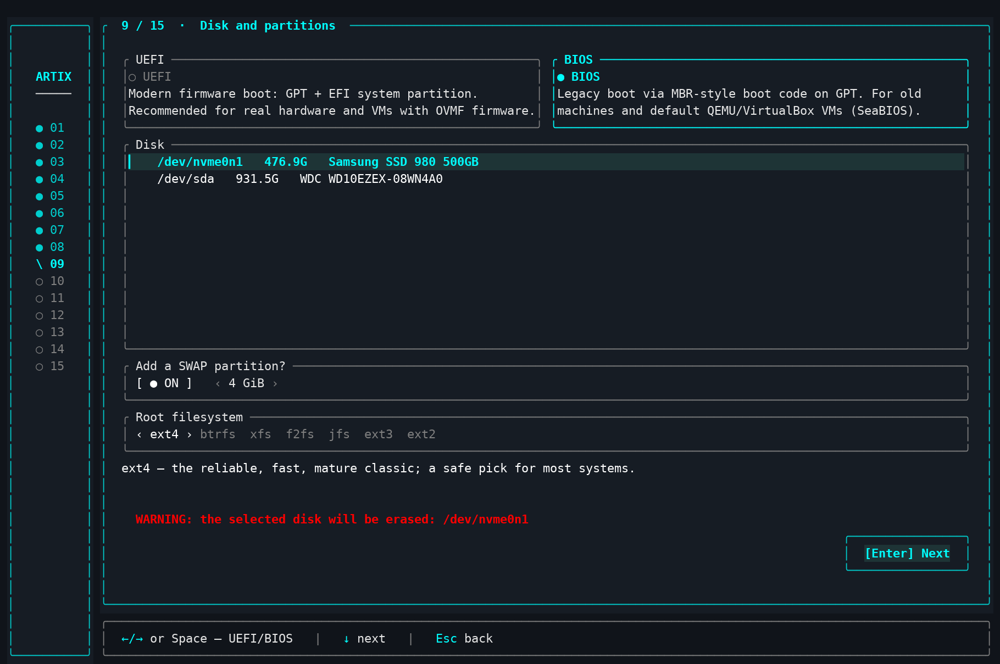

*Captured in a graphical terminal; on a bare TTY the colors are simpler (see the note in the Screenshots section).*

Schematically, every screen is laid out like this:

```
┌───────────┬──────────────────────────────────────────────┐
│  ◆  01    │  09 · Disk & partitions                       │
│  ●  02    │  ┌────────────────────────────────────────┐   │
│  ●  …     │  │  Mode       ● UEFI   ○ BIOS             │   │
│  ◆  09    │  │  Disk: /dev/sda  256G                   │   │
│  ○  10    │  │  Add SWAP?  [yes]  [ 4 GiB ]            │   │
│  ○  …     │  │  Filesystem  ‹ ext4 ›  btrfs  xfs       │   │
│           │  │              ◂ Back        Next ▸       │   │
│           │  │                                          │   │
│           │  └────────────────────────────────────────┘   │
│           ├──────────────────────────────────────────────┤
│           │  ↑/↓ move · ←/→ change · Enter next           │
└───────────┴──────────────────────────────────────────────┘
```

The left rail shows only step numbers (a small diamond spins on the active step);
the full step name is in the panel header.

---

## ⌨️ Controls

| Keys | Action |
|---|---|
| ↑ / ↓ | move through lists and fields |
| Enter | select / next |
| Esc or Shift+Tab | back; Esc also closes modal dialogs |
| ↑ on the top item | leave to the previous screen |
| Space | mark an item / flip a toggle |
| ← / → | change a value: filesystem, SWAP size, account mode, session |
| Typing | filter lists, search packages, edit fields |
| Tab | next field on the Accounts screen |
| o | filesystem options (the Disk & partitions screen) |
| w / s | scroll the description inside the FS-options dialog |
| PgUp / PgDn · Home / End | fast scrolling in long lists and the installation log |
| q | quit the installer (blocked while installing) |
| Ctrl+C | emergency exit |

The footer line always shows the contextual key hints for the active screen.

---

## 🔨 Building

```sh
cd installer
cargo build --release
# → target/release/artix-installer
```

The read-only steps (timezone, keyboard, Wi-Fi, package search, disk listing)
degrade gracefully when their tools aren't available outside the target. The
install itself (partitioning, basestrap, chroot) needs root and a real target, so
**test it in a virtual machine**.

---

## 🚀 Running on official Artix

You don't have to run the installer from a custom image — you can run it straight
from any **official Artix**: both the console "base" ISOs and the community ISOs
that ship a desktop and a graphical installer (Calamares) — there you just open a
terminal and run this TUI instead of Calamares. Every host tool it needs (artools,
gptfdisk, cryptsetup, …) is pulled in automatically while it runs.

### Pre-built binary (easiest)

Download the built installer from the [releases page](https://github.com/YellowHearth1/artix-tui-installer/releases)
and run it as root:

```sh
curl -LO https://github.com/YellowHearth1/artix-tui-installer/releases/latest/download/artix-installer
chmod +x artix-installer
sudo ./artix-installer
```

### Build from source

`base-devel` provides the compiler and linker that `cargo` needs:

```sh
sudo pacman -S --needed git rust base-devel
git clone https://github.com/YellowHearth1/artix-tui-installer.git
cd artix-tui-installer/installer
cargo build --release
sudo ./target/release/artix-installer
```

A few notes:

- The installer **must run as root** — it partitions disks and runs `basestrap`
  and `chroot`.
- It's a full-screen TUI: run it in a real console (`Ctrl`+`Alt`+`F2`) or a
  terminal in the live desktop, at least **80×24** in size.
- On a live ISO, building from source happens in RAM; if RAM is tight, grab the
  pre-built binary above or build it on another Artix machine and copy the single
  file over to the target.
- ⚠️ The installer **formats disks** — test in a virtual machine first.

---

## 🧭 Wizard steps

The installer opens with a mode chooser: **Install** or **System recovery**.
Install runs 15 steps:

1. **Language** — Ukrainian / English; sets the UI language and the system locale.
2. **Timezone** — the full IANA list with a filter search.
3. **Wi-Fi** — skip (wired), scan, or connect via `nmcli`.
4. **Keyboard** — console layouts via `localectl`; the first checked is primary.
5. **Kernel** — linux / lts / zen / hardened.
6. **Desktop** — pick a desktop (or none) and the seat manager.
7. **Packages** — GPU driver + search and multi-select from the repos.
8. **AUR** — a curated recommended list and a live AUR search.
9. **Disk** — boot mode, target disk, SWAP, and root filesystem.
10. **Bootloader & encryption** — choose the bootloader (GRUB / rEFInd / Limine / EFISTUB),
    other-OS detection (`os-prober`, GRUB only), the UEFI entry label, and disk
    encryption: root-only, full (encrypted `/boot`) or a USB key, with scope and
    passphrase. Comes **before** the extra disks so the key on an extra disk
    actually makes sense.
11. **Additional disks** — for each detected disk/partition: format (or keep the
    data), where to mount it (home / `/mnt` / a custom path with a folder name)
    and a separate encryption checkbox. Nothing changes until you choose.
12. **User** — hostname, account mode, username, and passwords (kept in memory
    only; never written to disk by the installer).
13. **Options** — passwordless sudo, the Chaotic-AUR repository, and mirror
    optimisation.
14. **Install** — a review, then a live log runs the plan step by step; it stops
    on error and lets you go **Back**.
15. **Finish** — a summary and reboot.

Navigation is the same everywhere: `↑`/`↓` moves focus (and Up on the topmost
item returns to the previous step), `←`/`→` changes a value, `Enter` advances,
`Esc` closes a popup or goes back.

---

## 🧱 How the install is organized

`src/system/install.rs` builds a single ordered list of actions; the install
screen runs each one, streaming output live. Roughly:

install host tools → partition → format (LUKS if asked) → mount → **phase 1**
`basestrap` a minimal bootable base (kernel, firmware, dinit + services, audio,
logging) → set up repos + keys → **phase 2** interactive `pacman` for the desktop,
drivers, and your extra packages → accounts → locale / timezone / keymap /
hostname + hosts → user-dinit wiring (turnstile or userspawn) → initramfs (with
the `encrypt` hook when encrypting) → bootloader → embedded nftables → log
rotation → enable all dinit services → **phase 3** AUR via `paru`.

---

## 🌳 Btrfs: subvolumes, auto-snapshots & system rollback

Choosing **btrfs** on the "Disk & partitions" step reveals extra options under the filesystem picker (each explained right in the UI with its gain/loss):

- **Subvolumes** — the `@` (root), `@home`, `@snapshots` → `/.snapshots`, `@log` → `/var/log`, `@cache` → `/var/cache` layout. System snapshots leave `/home` alone and don't get bloated by logs or cache.
- **Auto-snapshots (snapper + snap-pac)** — a snapshot **before and after every pacman/paru transaction**; enables subvolumes automatically (needs `@snapshots`).
- **Compression (zstd)** — transparent `compress=zstd` on write.
- **SSD TRIM** — `discard=async` in the background.
- **noatime** is available separately for any filesystem.

The root is always mounted with `rootflags=subvol=@` — by name, not via the default subvolume.

What the installer sets up for snapshots:

- **snapper** is configured by writing `/etc/snapper/configs/root` directly (`create-config` fails inside a chroot): `TIMELINE_CREATE=no` — snapshots are tied to pacman events, not the clock; `NUMBER_LIMIT=10` — the latest ~10 are kept.
- **Scheduled cleanup** — `/etc/cron.d/snapper` (daily at 5:30) via cronie, because dinit has no systemd timers.
- **A first-boot baseline snapshot** — a one-shot background job waits for D-Bus and snapper to come up, takes a "clean system (post-install baseline)" snapshot, and removes itself.

Rollback works **on any bootloader** (GRUB, rEFInd, Limine):

- **`sudo artix-rollback [N]`** — lists the snapshots; the chosen one becomes the new `@`, the old root is kept as `@.rollback-<stamp>`, the default subvolume is repointed, and the stale pacman lock is dropped from the snapshot (snap-pac takes its PRE snapshot while `db.lck` is still held). There is also an app-menu launcher.
- **Pre-boot rollback** — the `artix.rollback` kernel parameter opens a snapshot picker straight from the initramfs; the mkinitcpio hook runs **after** `encrypt`, so it works with LUKS too. On **GRUB** there is a dedicated **System Rollback** menu entry for it.
- Plain `snapper rollback` works as well.

The rollback is **independent of the live kernel**: `/boot` keeps a frozen pair — `vmlinuz-artix-rescue` + `initramfs-artix-rescue.img` — that pacman never touches. The *System Rollback* entries in GRUB, rEFInd and Limine boot exactly this pair, so the snapshot picker still starts even when an update broke the kernel or the initramfs (and a plain *rescue kernel* entry sits next to it, for a normal boot on the spare kernel with no rollback involved). The pair is refreshed only after a successful normal boot: the `artix-rescue-sync` service fires after 30 s of uptime and first verifies the running kernel IS the live one (a byte compare against `/usr/lib/modules/$(uname -r)/vmlinuz`), so a broken kernel can never poison the copy. Right after a rollback, the one-shot `artix-rollback-fixup` reconciles `/boot` with the restored system: it reinstalls the kernel from the snapshot's `/usr/lib/modules`, rebuilds the initramfs, refreshes the GRUB menu and re-freezes the rescue pair.

> **Why not grub-btrfs:** its snapshot submenu boots snapshots read-only via an overlayfs hook that is broken on kernels ≥ 6.8 (Antynea/grub-btrfs #328) — the entries simply fail to boot. `artix-rollback` instead swaps `@` and boots the restored root **read-write**, no overlay, on any kernel and bootloader.

---

## 📀 ISO profile (`iso-profile/`, for artools `buildiso`)

- `Packages-Root` / `Packages-Live` — packages for the live image (dinit only).
- `profile.conf` — autologin/display-manager settings for the live session.
- `live-overlay/usr/bin/installer-launch` — gives the TUI a real controlling
  terminal on tty1 (`setsid -c`), with a fallback shell on failure.
- `live-overlay/etc/dinit.d/installer.conf` — the autostart service that runs the
  installer instead of a getty on tty1.
- `grub-overrides/loopback.cfg` — boots straight into the installer.

Drop the compiled binary at `live-overlay/usr/bin/artix-installer`, then run
`sudo buildiso -p <profile>`.

---

## 🗂️ Project layout

```
installer/        Rust sources (ratatui TUI + install logic)
  src/app.rs      state model + config
  src/event.rs    global key handling / navigation
  src/main.rs     entry point + the "graphical installer" chrome
  src/screens/    one module per wizard step
  src/system/     disk, runner (PTY), install plan, packages, recovery
  src/assets/     embedded configs (kitty, fastfetch, waybar, wofi, pinnacle)
  i18n/           UI strings en.toml / uk.toml
iso-profile/      artools buildiso profile + live-image overlay
screenshots/      screenshots for the README (15 wizard steps)
```

---

## 📸 Screenshots

> **Note.** All screenshots were taken in a graphical terminal emulator on a machine with a desktop environment installed. On a bare TTY (e.g. right after booting the Artix base image) the interface looks much more modest: the kernel console offers only 16 colors and its own fixed font, so some of ratatui's effects — smooth shades, dimmed tones, rounded borders — are unavailable or simplified there. Functionally everything works the same.

A full walk-through of the wizard — all **15 steps**. The interface is bilingual (Ukrainian / English); the screenshots below are in Ukrainian.

**Step 1/15 — Language.** The installer and system language.

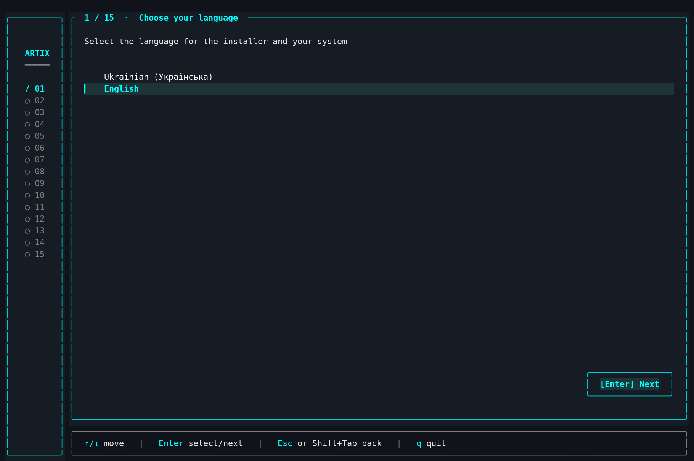

**Step 2/15 — Timezone.** Search and pick your timezone.

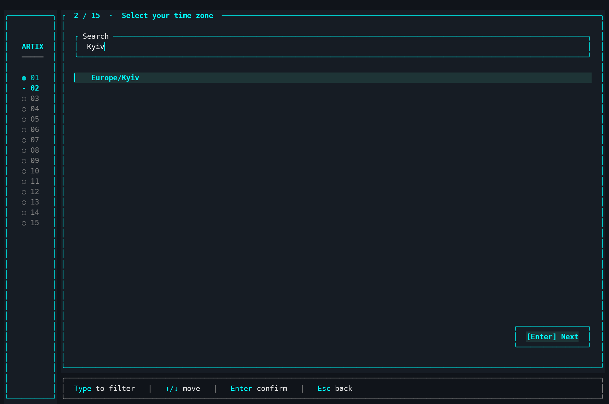

**Step 3/15 — Network.** Skip (wired) or scan Wi-Fi: pick an adapter, a network, and enter the password.

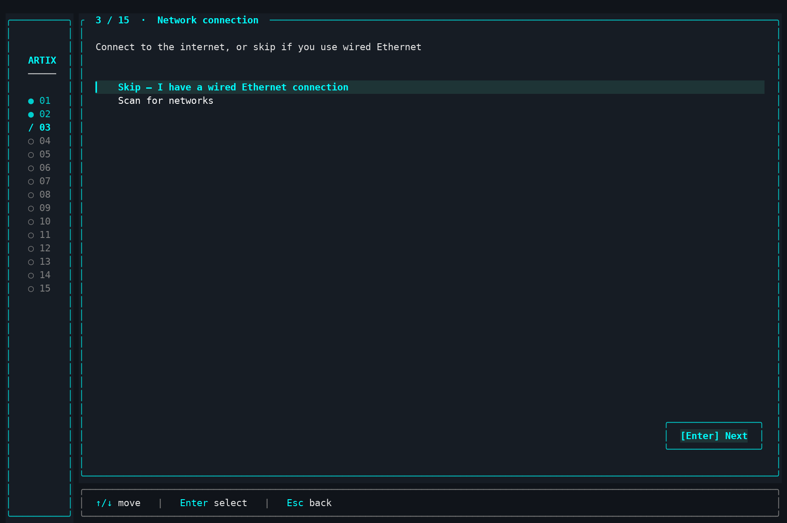

**Step 4/15 — Keyboard.** Multi-select layouts with a filter; the first ticked one becomes primary.

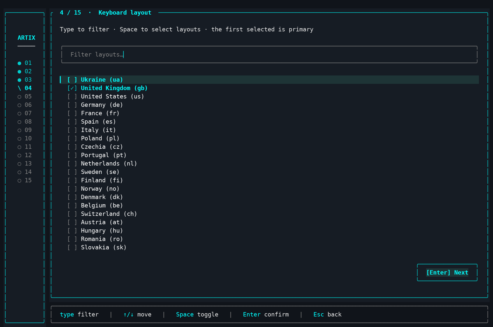

**Step 5/15 — Kernel.** Linux, Linux Zen, Linux Hardened or Linux LTS.

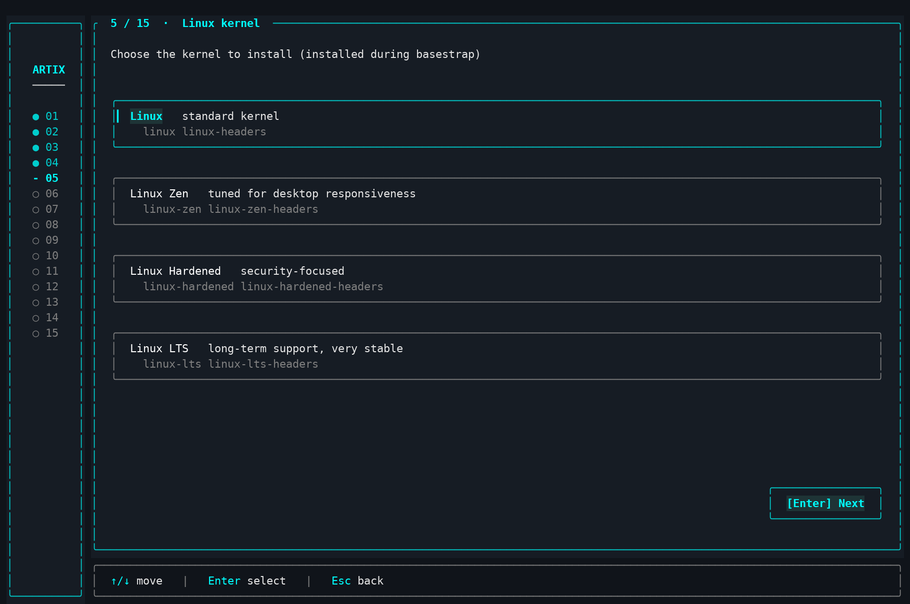

**Step 6/15 — Desktop.** Multi-select desktops, toggle the session (Wayland/X11), and choose a login screen.

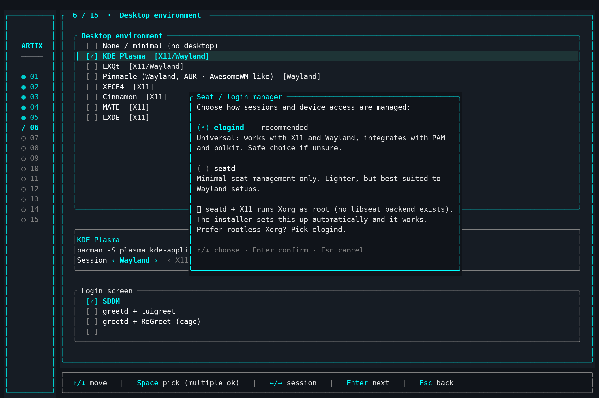

**Step 7/15 — Packages.** GPU drivers + search and pick popular packages.

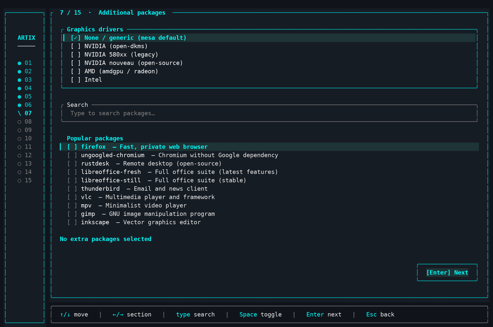

**Step 8/15 — AUR.** Search the AUR and recommended packages (built via paru).

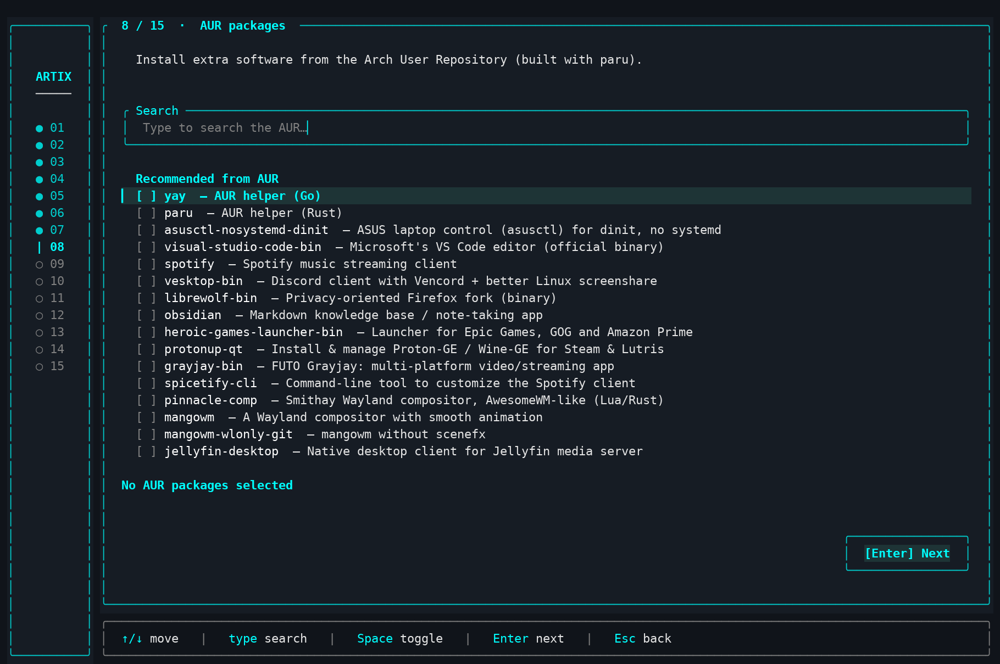

**Step 9/15 — Disk & partitions.** UEFI/BIOS, disk selection, SWAP partition, root filesystem.


**Step 10/15 — Bootloader & encryption.** GRUB / rEFInd / Limine / EFISTUB, os-prober, UEFI entry name, LUKS encryption.

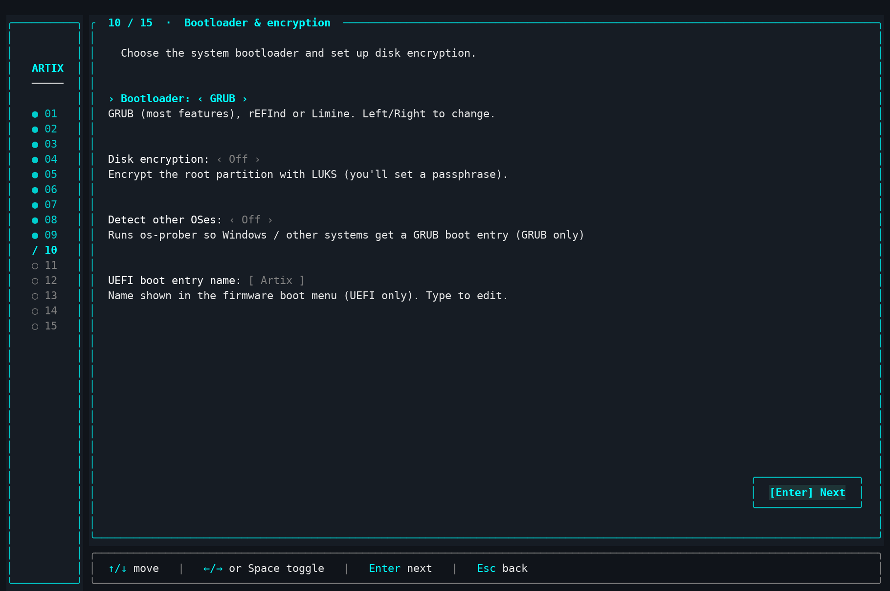

**Step 11/15 — Extra disks.** Mount other disks and existing partitions (e.g. a Windows NTFS one — keeping its data).

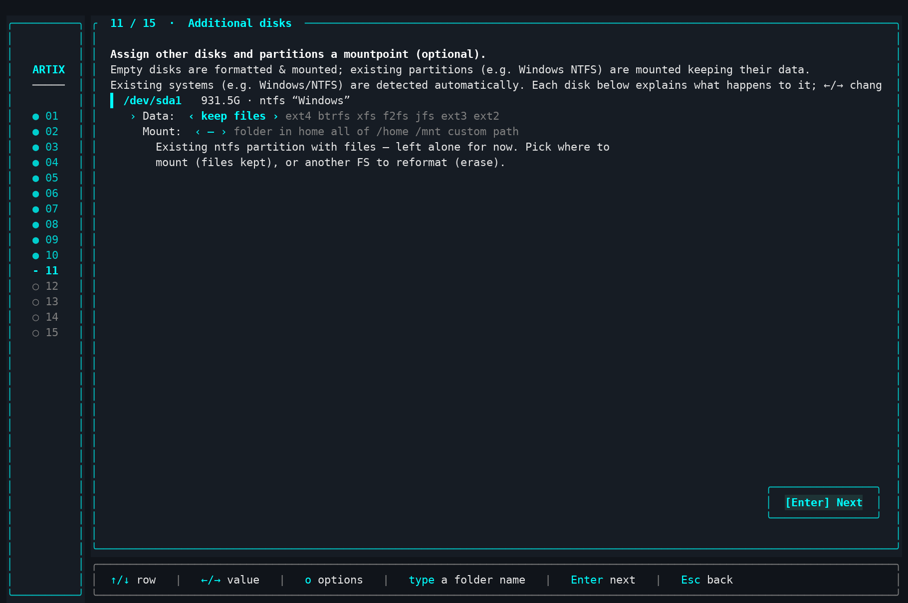

**Step 12/15 — Accounts.** Hostname, user and passwords; account mode.

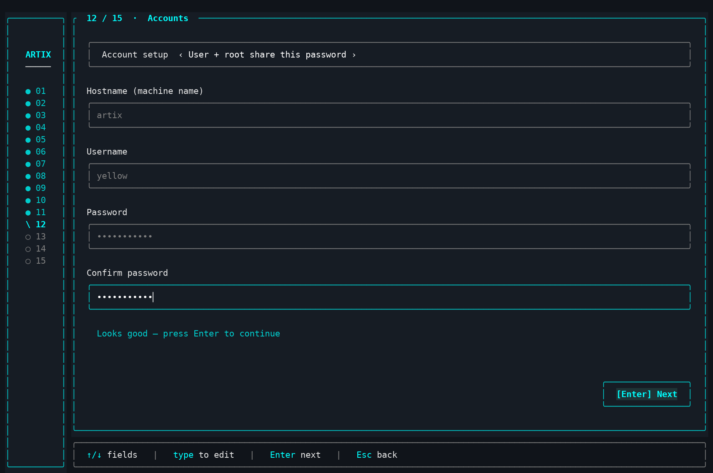

**Step 13/15 — Install options.** sudo password, Chaotic-AUR repo, mirror optimization.

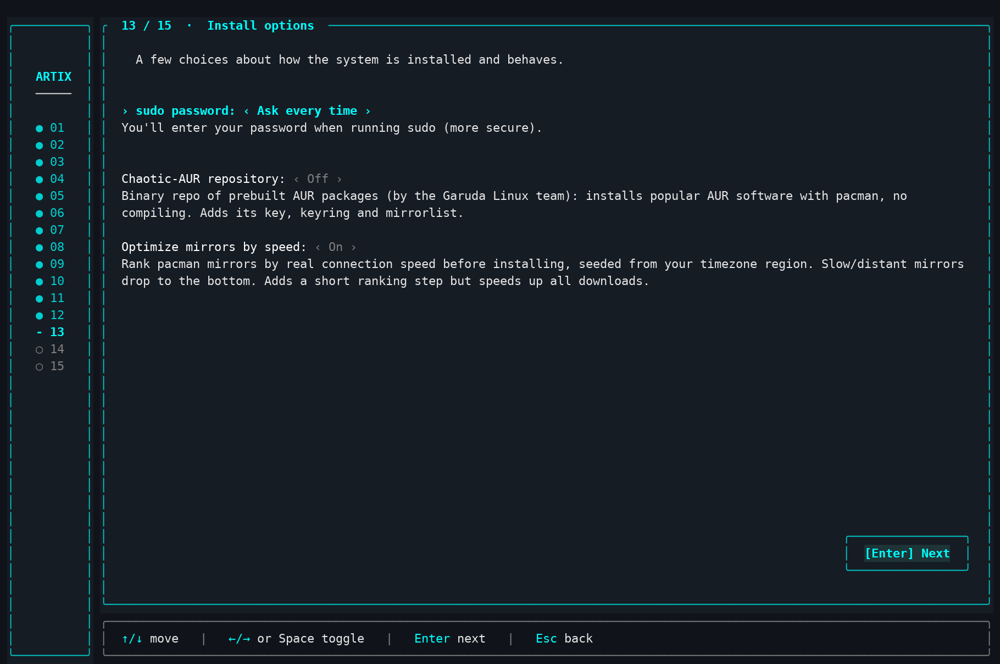

**Step 14/15 — Review & install.** A summary of every choice before it starts.

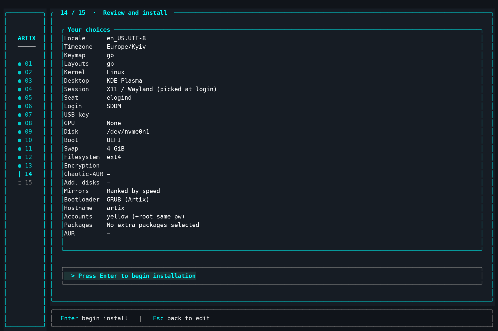

**Step 15/15 — Finish.** A donation QR code for Ukraine's defense, plus a choice: reboot, power off, or enter the installed system for manual steps.

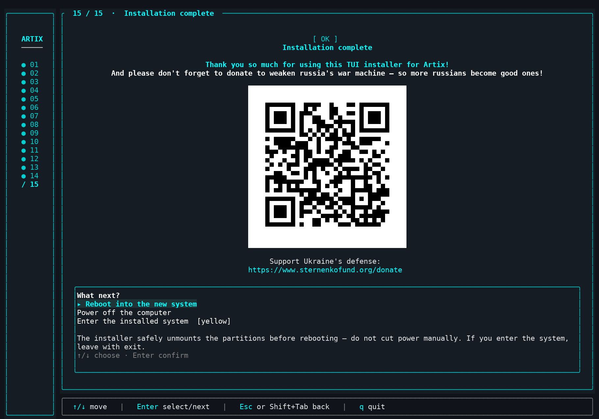

---

## 📄 License

Released under the **Apache 2.0** license — full text in [`LICENSE`](LICENSE).
