<div align="center">

# 🐧 Instalador TUI de Artix 

[🇺🇦 Українська](README.md) · [🇬🇧 English](README.en.md) · **🇲🇽/🇪🇸 Español**

### Un instalador TUI bilingüe de Artix Linux — dinit, LUKS, reversión de btrfs, Wayland. Sin systemd.

<a href="https://github.com/YellowHearth1/artix-tui-installer/actions/workflows/ci.yml"></a>


<a href="LICENSE"></a>


<br>

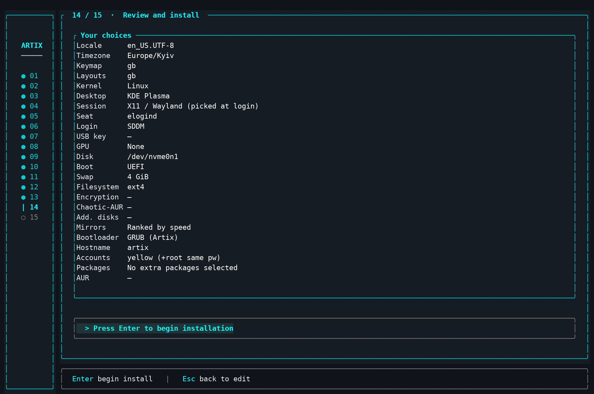

<br>


[](ARCHITECTURE.es.md)

**[Mapa del código, cambios comunes, build y tests → ARCHITECTURE.es.md](ARCHITECTURE.es.md)**

**Un instalador terminal bilingüe (inglés / ucraniano) para un spin personalizado
de [Artix Linux](https://artixlinux.org) que ejecuta
el init [dinit](https://davmac.org/projects/dinit/) como sistema de inicio.**

Hecho en Rust con [ratatui](https://ratatui.rs) y con estilo para sentirse como un instalador gráfico moderno: un carril
de pasos a la izquierda, paneles con bordes redondeados, un acento azul de Artix, con interruptores segmentados
y un registro de instalación en vivo con scroll.

[](https://www.rust-lang.org/)
[](https://ratatui.rs)
[](https://davmac.org/projects/dinit/)

🇺🇦 **[Українська версія → README.md](README.md)**<br>
🇬🇧 **[English version → README.en.md](README.en.md)**<br>
🇲🇽/🇪🇸 **[Version en Español → README.es.md](README.es.md)**<br>

</div>

---

> ### 🤖 Autoría del código
>
> **Todo el código de este proyecto fue escrito por [Claude](https://claude.ai), un
> modelo de IA de [Anthropic](https://www.anthropic.com).** La arquitectura, el depurado iterativo y la implementación
> se generaron completamente con Claude en una conversación.
> La visión de diseño, las pruebas en hardware real y en máquinas virtuales, y las decisiones específicas de Artix/dinit
> pertenecen al autor del proyecto.

---

📋 **[Changelog](CHANGELOG.md)** — qué cambió en cada versión.

## ✨ Funciones

- **🌐 Interfaz bilingüe** — inglés, español, y ucraniano, seleccionable en la primera pantalla.
- **⚙️ dinit-native** — configura una instancia de dinit por usuario al estilo de dinit,
  sin asumir systemd en ningún lugar:
  - **turnstile** para `seatd` (su propio módulo PAM, no se necesita elogind);
  - **userspawn** para `elogind` (la opción estándar de Artix);
  - el administrador de asientos `seatd`/`elogind` y servicios de audio PipeWire por usuario.
- **📦 Instalación interactiva de paquetes** — los paquetes se instalan mediante `pacman` 
  ejecutándose bajo un PTY, así que tú eliges proveedores (controladores GPU/Vulkan, backends 
  multimedia, …) en lugar de que se elija el primero silenciosamente. En el mismo paquete
  entre repos, se prefiere automáticamente Artix; los prompts `[Y/n]` se confirman automáticamente.
- **🔒 Cifrado de disco LUKS** — solo para root, disco completo con un `/boot` cifrado
  en UEFI, o una **llave USB** (una keyfile significa que ingresas la contraseña una sola vez).
- **🥾 Elección del cargador de arranque** — GRUB, rEFInd, Limine o EFISTUB; con GRUB, `os-prober` para
  detectar otros sistemas operativos. Configurado antes del paso del disco extra.
  - **Arranque dual Artix-junto-a-Artix.** Cada sistema agrega su(s) vecino(s) al menú
  de GRUB (el generador `/etc/grub.d/35_artix_neighbours`, porque `os-prober` no detecta
  un Linux cuyos kernels viven en el ESP). Pero un sistema instalado más **tarde**
  solo se vuelve visible para el anterior después de que ese anterior regenera
  su `grub.cfg` — lo cual ocurre automáticamente en la primera actualización de
  kernel o de GRUB (el hook `zz-artix-grub` de pacman), o inmediatamente
  manualmente: `doas grub-mkconfig -o /boot/grub/grub.cfg`. El arranque en sí no depende de
  esto: el instalador también escribe un cargador compartido de respaldo, `EFI/BOOT/BOOTX64.EFI` (del sistema
  más nuevo, que los enumera a todos), así que la máquina
  siempre llega a un menú funcional.
- **📦 EFISTUB (arranque sin cargador de arranque)** — el firmware UEFI carga el kernel
  **directamente**, sin un cargador intermedio (los kernels de Artix ya se construyen
  como stubs EFI, `CONFIG_EFI_STUB=y`). El initramfs y el cmdline se pasan vía
  una entrada `efibootmgr`. No necesita paquetes extra ni systemd — a diferencia de UKI,
  que requiere `systemd-stub`. Solo UEFI; incompatible con un `/boot` cifrado.
  **Compatible con reversión** — kernel, initramfs y cmdline se mantienen como archivos
  separados, así que el instalador registra entradas UEFI adicionales para reversión y
  rescate (seleccionado desde el menú de arranque del firmware). Esto es la base para Secure Boot (abajo).
- **🔐Preparación para Secure Boot (solo EFISTUB)** — el instalador **prepara** pero deliberadamente 
  **no habilita** Secure Boot: instala `sbctl`, genera claves de firma y escribe una guía
  detallada bilingüe a `~/SECURE-BOOT.txt`. Los pasos finales — registrar claves (`sbctl enroll-keys`),
  firmar el kernel y poner el firmware en **Setup Mode** — se dejan al usuario en el sistema
  instalado, porque no pueden automatizarse de forma segura. **Nota: esto necesita pasos de
  BIOS/UEFI y en algunos equipos un mal registro de claves puede dejar el dispositivo “irrecuperable”.
  El instalador muestra advertencias explícitas. `sbctl` incluye un hook de pacman
  que vuelve a firmar el kernel
  en cada actualización.
- **🔐 Discos adicionales** — monta otros discos o particiones (debajo de home, `/mnt`,
  o una ruta personalizada), opcionalmente formateando o cifrando cada uno.
  Los discos extra cifrados se desbloquean automáticamente al arrancar (clave en la
  raíz cifrada, vía un servicio dinit), independientemente de cómo se desbloquee la raíz en sí.
- **💾 Elección de filesystem** — ext4, btrfs, xfs, f2fs, jfs, ext3, ext2.
- **🌳 Btrfs con snapshots y reversión** — @/@home/@snapshots/@log/@cache subvolúmenes, auto-snapshots alrededor de cada acción de pacman (snapper + snap-pac), y `artix-rollback` en cualquier cargador de arranque (una entrada de menú gráfica bajo GRUB/rEFInd/Limine; una entrada separada del menú de arranque del firmware bajo EFISTUB).
- **🖥️Elección de escritorio** — KDE Plasma, LXQt, Pinnacle (un compositor Wayland
  tipo AwesomeWM), XFCE, Cinnamon, MATE, LXDE, o ninguno.
- **🎮Controladores de GPU** — NVIDIA (open-dkms), NVIDIA 580xx (legacy), nouveau, AMD,
  Intel; nouveau se bloquea automáticamente cuando se elige un driver propietario.
- **🛟 Modo de recuperación del sistema** — monta una instalación existente (desbloqueando LUKS
  si hace falta), detecta el cargador de arranque y abre un shell chroot para repararlo.
- **Soporte AUR** — `paru` se construye desde el código fuente (así siempre coincide con
  el `libalpm` del sistema), y luego se usa para instalar los paquetes que seleccionaste.
- **🧩Habilitación automática del servicio dinit** — cualquier paquete `*-dinit` instalado tiene 
  su servicio habilitado automáticamente, tanto si proviene de los repos como del AUR.
- **📜 Salida de sistema lista para usar** — `syslog-ng` recopila todos los logs a
  `/var/log`, y `logrotate` (vía `cronie`) mantiene **una semana**, elimina lo anterior,
  y rota inmediatamente si un archivo supera **5 GB**. Los logs de servicios del usuario
  se guardan en un buffer, así que `dinitctl catlog` funciona para ellos desde el inicio.
- **🔥 Firewall prebakeado** — una config embebida de nftables abre los puertos para KDE
  Connect, LocalSend, Sunshine, RustDesk, Steam Remote Play, Syncthing y SSH.
- **🎨Configs embebidas** — kitty (Catppuccin Mocha), un prompt starship,
  fastfetch, plus waybar y wofi para Pinnacle; no se requieren assets externos.
- **🕹️Listo para gaming** — aumenta el límite de archivos abiertos (`nofile`) para Wine/Proton
  fsync, y opcionalmente configura `auto-cpufreq` automáticamente.
- **🧳Autocontenido** — las herramientas del host que necesita (artools, gptfdisk, cryptsetup,
  …) se instalan automáticamente, así que el instalador funciona incluso desde el **Artix ISO oficial**,
  no solo desde su propia imagen.
- **🏷️ Configurable** Hostname y etiqueta de entrada UEFI configurables.
- **🚦Inicio cuidadoso** — el disco solo se toca tras tu confirmación explícita
  en la pantalla “Revisar e instalar”, y las herramientas del host requeridas (git, gptfdisk,
  dosfstools, parted, …) se obtienen en segundo plano en cuanto la red está activa.
- **⚠️ Avisos previos de disco** — en la pantalla de selección de disco el instalador te aconseja
  (sin bloquear la elección) cuando: el disco seleccionado es el **medio de arranque** desde el que
  el instalador se está ejecutando (detectado por el sistema de archivos de la imagen live iso9660);
  el disco es **más pequeño que 20 GiB** (un sistema base encaja, pero un escritorio completo
  puede quedarse sin espacio); o el modo elegido **UEFI/BIOS no coincide** con el firmware
  en el que realmente arrancaste (lo cual produciría un sistema que no puede arrancar).
  Cada aviso es una frase completa, en lenguaje sencillo, en un modal desplazable (presiona `w` en
  la lista de discos); siempre puedes continuar si de verdad quieres.
- **🧨 Confirmación de borrado** — el último paso antes del formateo: un modal dedicado muestra con exactitud
  qué disco (ruta, modelo, tamaño) y qué **particiones existentes** serán destruidas,
  y requiere un Enter explícito. El formateo nunca comienza sin
  esta segunda confirmación, lo que hace mucho más difícil borrar por accidente
  el disco equivocado.
- **🚫 Los mirrors excluidos nunca llegan a tu sistema** — se eliminan de las listas
  **por completo y sin excepciones**: nunca se consultan, nunca se ordenan,
  ni siquiera se dejan comentados, y están ausentes de la copia de respaldo de la lista.
  Esto no es una opción y no depende del interruptor de optimización de abajo — la lista de Artix
  se limpia antes de `basestrap`, y las listas de Arch, Chaotic-AUR y 
  del sistema ya instalado se limpian dentro del chroot, así que ningún
  paquete puede provenir de una fuente excluida durante la
  instalación o después. La exclusión se decide tanto por
  la sección de país bajo la cual se registra un servidor como por el hostname en sí,
  ya que algunos de estos mirrors están en dominios que no revelan nada.
- **🪞 Mirrors rápidos y resilientes** — justo antes de que se instalen los paquetes,
  el instalador hace un health-check **de cada** mirror en cada lista (Artix, Arch y
  Chaotic-AUR), activos y comentados por igual: 12 probes en paralelo,
  límite de 6 s para cada una. Los que están vivos se reescriben **primero los de respuesta más rápida**,
  y los que están muertos o avanzan lento se comentan con un motivo. No hay conjeturas geográficas
  ni de zona horaria — el ordenamiento proviene de una medición real. Un mirror que muere
  a mitad de una descarga ya no puede matar toda la transacción al 95 %: simplemente
  no está en la lista activa. La lista original se conserva a su lado como `*.bak-installer`,
  y si la red está caída y nadie responde, la lista se deja intacta.
  Además, hay un repositorio opcional de Chaotic-AUR con binarios AUR precompilados.
- **📊 Progreso en vivo** — un log de instalación en streaming con desplazamiento (PgUp/PgDn,
  Home/End); después de un fallo, vuelve a intentar sin perder ninguna de tus elecciones.
- **🏁 Tres formas de terminar** — reiniciar, apagar, o hacer chroot directamente dentro del nuevo
  sistema; las particiones se desmontan de forma segura en cada caso.
- 📀 Construido como un ISO live con **artools** (`buildiso`).

---

## 👁️ Vista

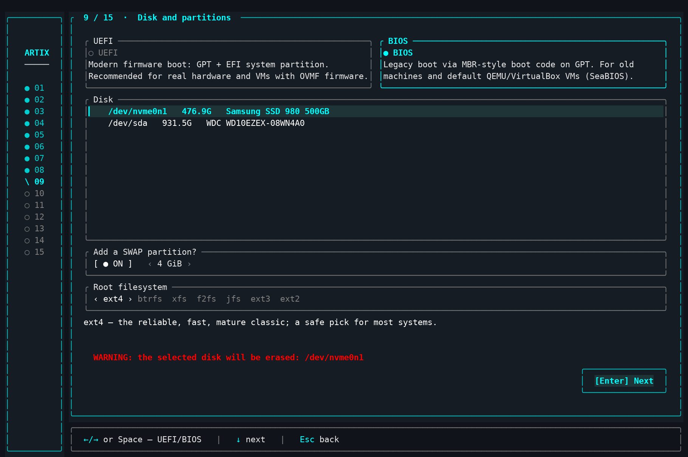

*Capturada en un terminal gráfico; en un TTY limpio los colores son más simples (ver la nota en la sección de Screenshots).*

De forma esquemática, cada pantalla se organiza así:

```
┌───────────┬───────────────────────────────────────────────┐
│	◆	01  │	09 · Disco y particiones					│
│	●	02	│	┌───────────────────────────────────────┐	│
│	●	…	│	│ Modo			  ● UEFI	  ○ BIOS	│	│
│	◆	09	│	│ Disco:		 /dev/sda	   256G		│	│
│	○	10	│	│ ¿Agregar SWAP?  [ sí ]	 [ 4 GiB ]	│	│
│	○	…	│	│ Filesystem	 ‹ ext4 ›  btrfs  xfs	│	│
│			│	│			     ◂ Atras   Siguiente ▸	│	│
│ 			│	│										│	│
│			│	└───────────────────────────────────────┘	│
│			├───────────────────────────────────────────────┤
│			│	↑/↓ mover · ←/→ cambiar · Intro siguiente	│
└───────────┴───────────────────────────────────────────────┘
```

El carril izquierdo muestra solo los números de paso (un pequeño diamante gira en el paso activo);
el nombre completo del paso está en el encabezado del panel.

---

## 🏳️‍🌈 slayfetch — fastfetch con tu propio logo

En el paso **“Paquetes adicionales”**, junto a `fastfetch`, hay una
entrada **`slayfetch`**. Es el mismo fastfetch, solo con un logo diferente:
el **logo de Artix sobre una de las banderas de la comunidad LGBTQIA+**. Elige `slayfetch`
en lugar de `fastfetch` (son mutuamente excluyentes: mantén solo uno), presiona **Space**,
y aparece una lista de logos; el elegido se muestra en la fila. Durante la instalación
se instala el paquete normal `fastfetch`, y el logo elegido
se deja en `~/.config/fastfetch/`.

> **Cómo habilitar:** Paso de Paquetes adicionales → desmarca `fastfetch` → marca
> `slayfetch` (Space) → en el selector que se abre, elige un logo (↑/↓, Enter).
> Listo.

> 🏳️‍🌈 **Nota del autor:** No soy miembro de la comunidad LGBTQIA+, pero 
> agregué estos logos de banderas como un gesto de apoyo y solidaridad.

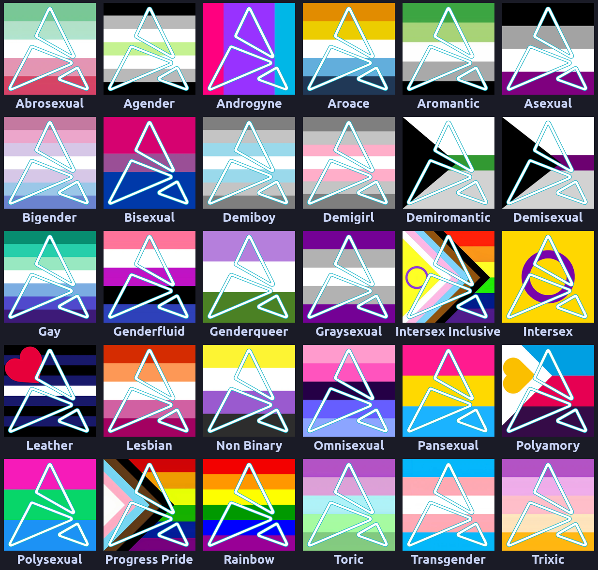

---

## ⌨️ Controles

|	Teclas					|	Acción										|
|----------------------------------|-----------------------------------------------------------|
|	↑ / ↓					|	moverte entre listas y campos						|
|	Intro					|	seleccionar / siguiente							|
|	Esc o Mayús+Tab			|	volver; Esc también cierra diálogos modales			|
|	↑ en el elemento superior	|	salir a la pantalla anterior						|
|	Espaciador					|	marcar un elemento / alternar un toggle				|
|	← / →					|	cambiar un valor: filesystem, tamaño de SWAP,		|
|							|	modo de cuenta, sesión							|
|	Escribiendo				|	filtrar listas, buscar paquetes, editar campos		|
|	Tab						|	siguiente campo en la pantalla Accounts				|
|	o						|	opciones de filesystem (pantalla Disk & partitions)	|
|	w / s					|	desplazarte en la descripción dentro del diálogo de	|
|							|	opciones de FS									|
|	AvPág / RePág · Inicio / Fin		|	desplazamiento rápido en listas largas y			|
|							|	el log de instalación							|
|	q						|	salir del instalador (bloqueado mientras instala)		|
|	Ctrl+C					|	salida de emergencia							|

La línea del pie de página siempre muestra las sugerencias de teclas contextuales para la pantalla activa.

<details>
<summary><b>⌨️ Atajos del gestor de ventanas de Pinnacle</b></summary>

> Fuente: la config que el instalador coloca en `~/.config/pinnacle`.
> **Mod** = la tecla **Super** (⊞ Win); la terminal por defecto es **kitty**.

**Aplicaciones**

|				Teclas		|	Acción							|
|----------------------------------|--------------------------------------------|
|	Mod + Intro · Mod + Q		|	terminal (kitty)					|
|	Mod + R					|	lanzador de apps (wofi)				|
|	Mod + E					|	gestor de archivos (Caja)			|
|	Mod + B					|	navegador (Firefox — si está instalado)	|
|	Mod + O					|	captura (Flameshot)					|
|	Mod + V					|	historial del portapapeles (cliphist)	|
|	Mod + N					|	panel de notificaciones (SwayNC)		|

**Ventanas**

|	Teclas					|	Acción							|
|----------------------------------|--------------------------------------------|
|	Mod + C					|	cerrar ventana						|
|	Mod + F					|	pantalla completa					|
|	Mod + M					|	maximizar							|
|	Mod + S · Mod + Ctrl + Espaciador	|	alternar ventanas flotantes			|
|	Mod + LMB (arrastrar)		|	mover ventana						|
|	Mod + RMB (arrastrar)		|	cambiar tamaño						|

**Etiquetas (workspaces 1–9)**

|	Teclas					|	Acción							|
|----------------------------------|--------------------------------------------|
|	Mod + 1…9					|	cambiar a la etiqueta				|
|	Mod + Mayús + 1…9			|	mover ventana a etiqueta				|
|	Mod + Ctrl + 1…9			|	alternar visibilidad de la etiqueta	|
|	Mod + Ctrl + Mayús + 1…9		|	fijar ventana a varias etiquetas		|

**Distribuciones**

|	Teclas				|	Acción								|
|-----------------------------|-------------------------------------------------|
|	Mod + Espaciador			|	siguiente layout (master-stack, dwindle…)	|
|	Mod + Mayús + Espaciador		|	layout anterior						|

**Compositor**

|	Teclas						|	Acción						|
|---------------------------------------|---------------------------------------|
|	Mod + Mayús + R · Mod + Ctrl + R	|	recargar la config				|
|	Mod + Mayús + Q				|	salir (con confirmación)			|
|	Mod + Ctrl + Mayús + Q			|	salir sin confirmación			|

**Medios y brillo** — las teclas XF86 del hardware funcionan incluso en
la pantalla de bloqueo: volumen ±2 % y silenciar (wpctl), silenciar el micrófono,
reproducir/pausar/detener/siguiente/anterior (playerctl), brillo ±10 % (brightnessctl).

</details>

---

## 🔨 Compilar

```sh
cd installer
cargo build --release
# → target/release/artix-installer
```

Los pasos de solo-lectura (zona horaria, teclado, Wi‑Fi, búsqueda de paquetes, listado del disco)
se degradan con gracia cuando sus herramientas no están disponibles fuera del entorno objetivo. La
instalación en sí (particionado, basestrap, chroot) requiere root y un objetivo real, 
así que **pruébalo en una máquina virtual**.

---

## 🚀 Ejecutar en Artix oficial

No tienes que ejecutar el instalador desde una imagen personalizada: puedes ejecutarlo
directamente desde cualquier **Artix oficial**: tanto las ISOs “base” de consola como las ISOs comunitarias
que traen un escritorio y un instalador gráfico (Calamares) — ahí solo abres
un terminal y ejecutas este TUI en lugar de Calamares. Cada herramienta del host que necesita (artools,
gptfdisk, cryptsetup, …) se trae automáticamente mientras se ejecuta.

### ISO precompilada (lo más fácil)

Una imagen live de Artix con el instalador incluido — grábala en un USB y arranca:

```sh
curl -LO https://github.com/YellowHearth1/artix-tui-installer/releases/latest/download/artix-tui-dinit-x86_64.iso
```

### Binario precompilado

Si ya estás arrancado (por ejemplo, desde el ISO oficial de Artix), solo ejecuta el
instalador como root:

```sh
curl -LO https://github.com/YellowHearth1/artix-tui-installer/releases/latest/download/artix-installer
chmod +x artix-installer
sudo ./artix-installer
```

Ambos links siempre apuntan a la **compilación más reciente** — GitHub maneja “latest”
por sí mismo. Cada build aparece listada en la [página de releases](https://github.com/YellowHearth1/artix-tui-installer/releases).

### Compilar desde el código fuente

`base-devel` proporciona el compilador y el linker que necesita `cargo`:

```sh
sudo pacman -S --needed git rust base-devel
git clone https://github.com/YellowHearth1/artix-tui-installer.git
cd artix-tui-installer/installer
cargo build --release
sudo ./target/release/artix-installer
```

Algunas notas:

- El instalador **debe ejecutarse como root** — particiona discos y
  ejecuta `basestrap` y `chroot`.
- Es un TUI en pantalla completa: ejecútalo en una consola real (`Ctrl`+`Alt`+`F2`)
  o en una terminal dentro del escritorio live, con al menos **80×24** de tamaño.
- En una ISO live, compilar desde el código fuente ocurre en la RAM; si la RAM está
  justa, toma el binario precompilado de arriba o créalo en otra máquina Artix y copia
  el único archivo sobre el destino.
- ⚠️ El instalador **formatea discos** — prueba primero en una máquina virtual.

---

## 🧭 Pasos del asistente

El instalador abre con un selector de modo: **Instalar** o **Recuperación del sistema**.
Instalar ejecuta 15 pasos:

1. **Idioma** — ucraniano / inglés; define el idioma de la UI y el locale del sistema.
2. **Zona horaria** — la lista completa IANA con búsqueda por filtro.
3. **Wi‑Fi** — omitir (cableado), escanear, o conectarte vía `nmcli`.
4. **Teclado** — layouts de consola vía `localectl`; el primero marcado se vuelve el primario.
5. **Kernel** — linux / lts / zen / hardened.
6. **Escritorio** — elige un escritorio (o ninguno) y el gestor de asientos.
7. **Paquetes** — controlador de GPU + búsqueda y multi-selección desde los repos.
8. **AUR** — una lista recomendada curada y una búsqueda AUR en vivo.
9. **Disco** — modo de arranque, disco objetivo, SWAP y filesystem raíz.
10. **Cargador de arranque y cifrado** — elige el cargador (GRUB / rEFInd / Limine / EFISTUB),
    otros-OS (`os-prober`, solo GRUB), el nombre de la entrada UEFI, y cifrado del
    disco: root-only, full (cifrado `/boot`) o una llave USB, con alcance
    y contraseña. Viene **antes** de los discos extra para que la clave en
    un disco extra realmente tenga sentido.
11. **Discos adicionales** — para cada disco/partición detectada: formatear (o conservar
    los datos), dónde montarlo (home / `/mnt` / una ruta personalizada con un nombre de carpeta)
    y un checkbox de cifrado separado. Nada cambia hasta que lo elijas.
12. **Usuario** — hostname, modo de cuenta, nombre de usuario y contraseñas (se mantienen
    en memoria; nunca se escribe en disco por el instalador).
13. **Opciones** — sudo sin contraseña, repo Chaotic-AUR y optimización de mirrors.
14. **Instalar** — una revisión y luego un log en vivo ejecuta el plan paso a paso;
    se detiene en caso de error y te deja ir **Atrás**.
15. **Finalizar** — un resumen y reinicio.

La navegación es igual en todas partes: `↑`/`↓` mueve el foco (y Arriba en el elemento superior regresa
al paso anterior), `←`/`→` cambia un valor, `Enter` avanza, `Esc` cierra un popup o regresa.

---

## 🧱 Cómo está organizado el instalador

`src/system/install.rs` construye una lista única y ordenada de acciones;
la pantalla de instalación ejecuta cada una, transmitiendo la salida en vivo. Más o menos:

herramientas del host → particionado → formateo (LUKS si se pide) → montar → **fase 1**
`basestrap` una base mínima arrancable (kernel, firmware, dinit + servicios, audio,
logging) → configurar repos + claves → **fase 2** interactivo `pacman` para el escritorio,
drivers, y tus paquetes extra → cuentas → locale / zona horaria / keymap /
hostname + hosts → cableado de usuario dinit (turnstile o userspawn) → initramfs (con
el hook `encrypt` al cifrar) → cargador de arranque → nftables embebido → rotación de logs →
habilitar todos los servicios dinit → **fase 3** AUR vía `paru`.

---

## 🌳 Btrfs: subvolúmenes, auto-snapshots y retroceso del sistema

Al elegir **btrfs** en el paso de "Disk & partitions" se revelan opciones extra bajo el selector de filesystem (cada una explicada directamente en la UI con su ganancia/pérdida):

- **Subvolúmenes** — `@` (root), `@home`, `@snapshots` → `/.snapshots`, `@log` → `/var/log`, `@cache` → `/var/cache` distribución. Los snapshots del sistema dejan `/home` solo y no se hinchan con logs o cache.
- **Auto-snapshots (snapper + snap-pac)** — un snapshot **antes y después de cada transacción pacman/paru**; habilita subvolúmenes automáticamente (necesita `@snapshots`).
- **Compresión (zstd)** — `compress=zstd` transparente al escribir.
- **SSD TRIM** — `discard=async` en segundo plano.
- **noatime** está disponible por separado para cualquier filesystem.

El root siempre se monta con `rootflags=subvol=@` — por nombre, no a través del subvolumen predeterminado.

Lo que el instalador configura para los snapshots:

- **snapper** se configura escribiendo `/etc/snapper/configs/root` directamente (`create-config` falla dentro de un chroot): `TIMELINE_CREATE=no` — los snapshots se ligan a eventos de pacman, no al reloj; `NUMBER_LIMIT=10` — se conservan los ~10 más recientes.
- **Limpieza programada** — `/etc/cron.d/snapper` (diario a las 5:30) vía cronie, porque dinit no tiene timers de systemd.
- **Un baseline de snapshot en el primer arranque** — un trabajo en segundo plano de una sola vez espera a que D-Bus y snapper estén listos, toma un snapshot de "sistema limpio (baseline post-instalación)", y se elimina a sí mismo.

El retroceso funciona **con cualquier bootloader** (GRUB, rEFInd, Limine):

- **`sudo artix-rollback [N]`** — lista los snapshots; el elegido pasa a ser el nuevo `@`, el root anterior se conserva como `@.rollback-<stamp>`, el subvolumen predeterminado se vuelve a apuntar, y el lock obsoleto de pacman se elimina del snapshot (snap-pac toma su PRE snapshot mientras `db.lck` todavía está retenido). También hay un launcher en el menú de apps.
- **Retroceso antes del arranque** — el parámetro de kernel `artix.rollback` abre un selector de snapshots directamente desde el initramfs; el hook de mkinitcpio se ejecuta **después** de `encrypt`, así que también funciona con LUKS. En **GRUB** hay una entrada de menú dedicada **System Rollback** para ello.
- `snapper rollback` plano también funciona.

El retroceso es **independiente del kernel live**: `/boot` mantiene un par congelado — `vmlinuz-artix-rescue` + `initramfs-artix-rescue.img` — que pacman nunca toca. Las entradas *System Rollback* en GRUB, rEFInd y Limine inician exactamente este par, así que el selector de snapshots sigue iniciando incluso cuando una actualización rompió el kernel o el initramfs (y una entrada de *kernel rescue* normal se encuentra al lado, para un arranque normal en el kernel de repuesto sin involucrar ningún retroceso). El par se actualiza solo después de un arranque normal exitoso: el servicio `artix-rescue-sync` se dispara después de 30 s de tiempo de funcionamiento y primero verifica que el kernel en ejecución sea el live (comparación byte a byte contra `/usr/lib/modules/$(uname -r)/vmlinuz`), así que un kernel roto nunca puede envenenar la copia. Justo después de un retroceso, el one-shot `artix-rollback-fixup` reconcilia `/boot` con el sistema restaurado: reinstala el kernel desde los `/usr/lib/modules` del snapshot, reconstruye el initramfs, refresca el menú de GRUB y vuelve a congelar el par rescue.

> **Porque no grub-btrfs:** su submenú de snapshots inicia snapshots en modo solo-lectura vía un hook de overlayfs que está roto en kernels ≥ 6.8 (Antynea/grub-btrfs #328) — las entradas simplemente fallan al arrancar. `artix-rollback` en cambio intercambia `@` y arranca el root restaurado **en modo lectura-escritura**, sin overlay, en cualquier kernel y bootloader.

---

## 📀 Perfil de ISO (`iso-profile/`, para artools `buildiso`)

- `Packages-Root` / `Packages-Live` — paquetes para la imagen live (dinit solo).
- `profile.conf` — configuración de autologin/display-manager para la sesión live.
- `live-overlay/usr/bin/installer-launch` — le da a la TUI un terminal controlador real
  en tty1 (`setsid -c`), con un shell de respaldo en caso de fallo.
- `live-overlay/etc/dinit.d/installer.conf` — el servicio de autostart que ejecuta el
  instalador en lugar de un getty en tty1.
- `grub-overrides/loopback.cfg` — arranca directamente hacia el instalador.

Suelta el binario compilado en `live-overlay/usr/bin/artix-installer`, luego ejecuta
`sudo buildiso -p <profile>`.

---

## 🗂️ Estructura del proyecto

```
installer/        Rust sources (ratatui TUI + install logic)
  src/app.rs      state model + config
  src/event.rs    global key handling / navigation
  src/main.rs     entry point + la "graphical installer" chrome
  src/screens/    un módulo por paso del wizard
  src/system/     disk, runner (PTY), install plan, packages, recovery
  src/assets/     configuraciones embebidas (kitty, fastfetch, waybar, wofi, pinnacle)
  i18n/           UI strings en.toml / uk.toml
iso-profile/      artools buildiso profile + live-image overlay
screenshots/      screenshots para el README (15 wizard steps)
```

---

## 📸 Capturas de pantalla

> **Note.** Todas las capturas de pantalla se tomaron en un emulador de terminal gráfico en una máquina con un entorno de escritorio instalado. En un TTY básico (p. ej. justo después de arrancar la imagen base de Artix) la interfaz se ve mucho más modesta: la consola del kernel ofrece solo 16 colores y su propia fuente fija, así que algunos de los efectos de ratatui — sombras suaves, tonos atenuados, bordes redondeados — no están disponibles o se simplifican allí. Funcionalmente todo funciona igual.

Un recorrido completo del asistente — todos los **15 pasos**. La interfaz es bilingüe (Ucraniano / Inglés); las capturas de pantalla de abajo están en ucraniano.

**Paso 1/15 — Idioma.** El idioma del instalador y del sistema.

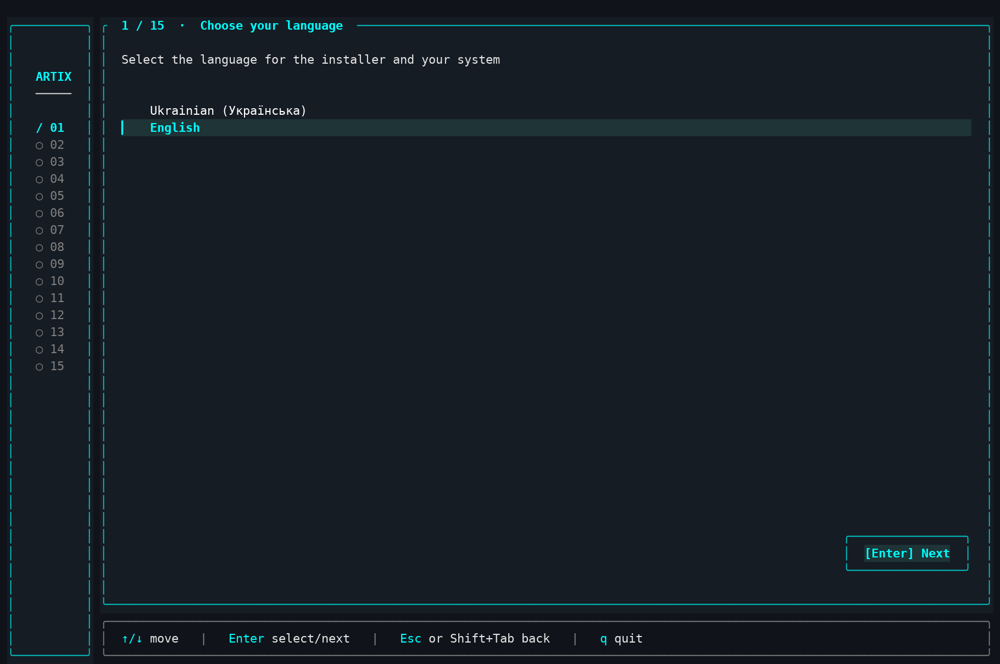

**Paso 2/15 — Zona horaria.** Busca y elige tu zona horaria.

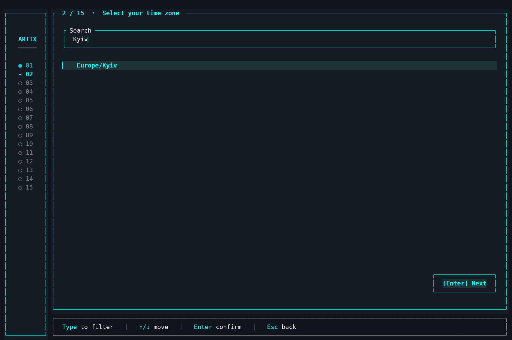

**Paso 3/15 — Red.** Omitir (cableado) o escanear Wi-Fi: elige un adaptador, una red y escribe la contraseña.

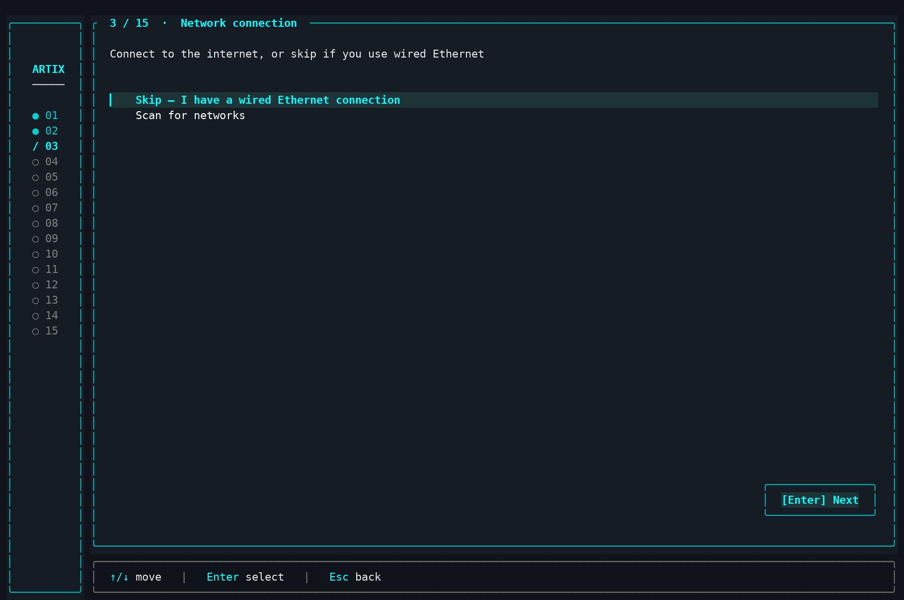

**Paso 4/15 — Teclado.** Disposiciones multi-selección con un filtro; la primera con marca se vuelve la principal.

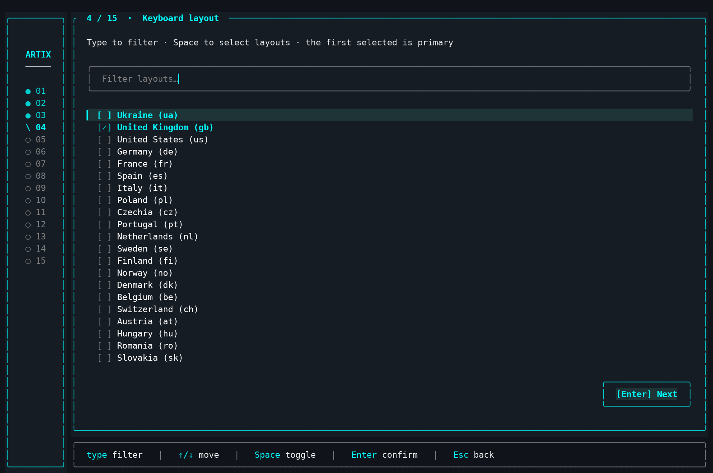

**Paso 5/15 — Kernel.** Linux, Linux Zen, Linux Hardened o Linux LTS.

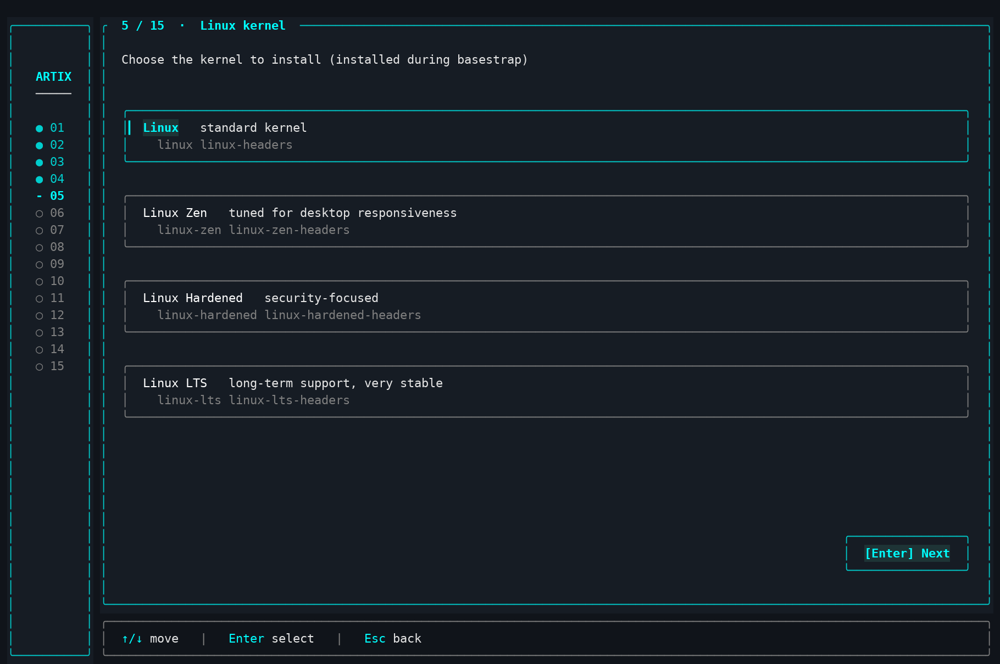

**Paso 6/15 — Escritorio.** Escritorios multi-selección, activa la sesión (Wayland/X11) y elige una pantalla de inicio de sesión.

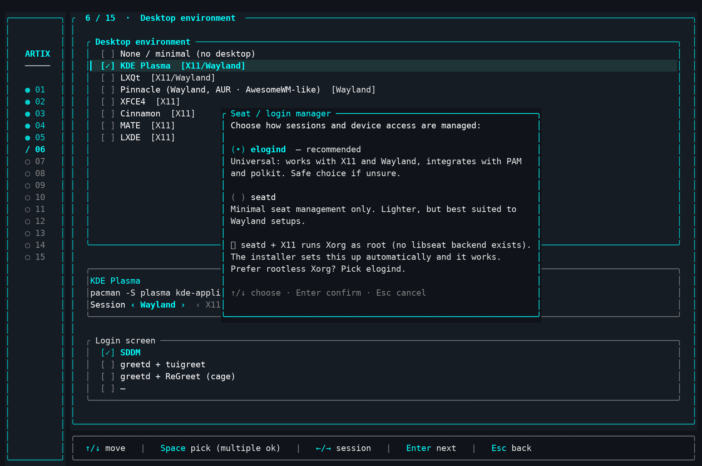

**Paso 7/15 — Paquetes.** Controladores de GPU + búsqueda y selección de paquetes populares.

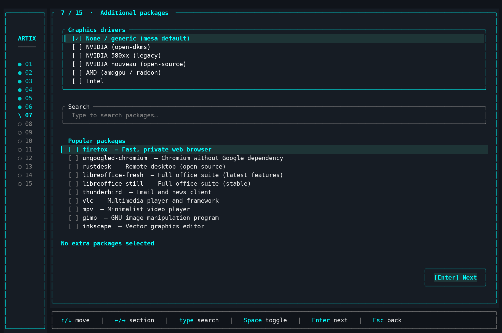

**Paso 8/15 — AUR.** Busca el AUR y paquetes recomendados (construidos vía paru).

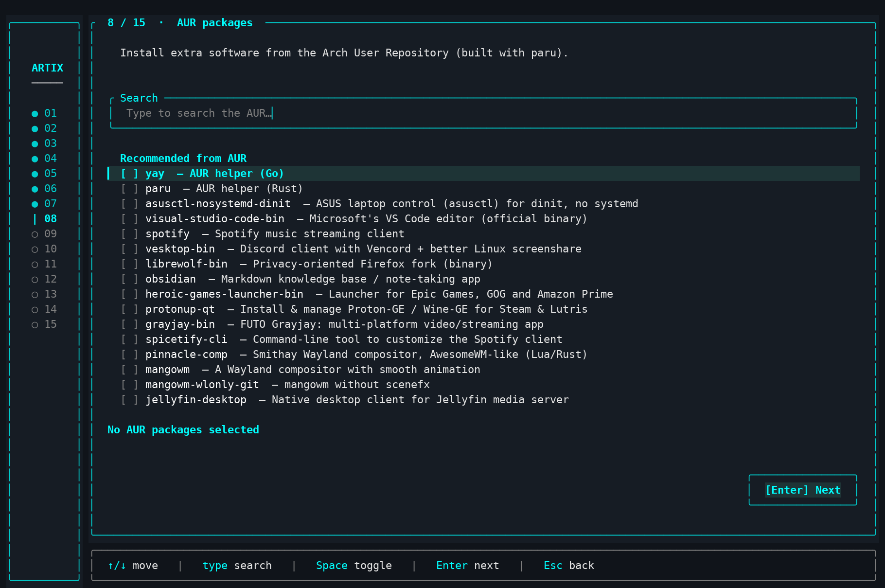

**Paso 9/15 — Disco y particiones.** UEFI/BIOS, selección de disco, partición SWAP, sistema de archivos del root.


**Paso 10/15 — Bootloader y cifrado.** GRUB / rEFInd / Limine / EFISTUB, os-prober, nombre de entrada UEFI, cifrado LUKS.

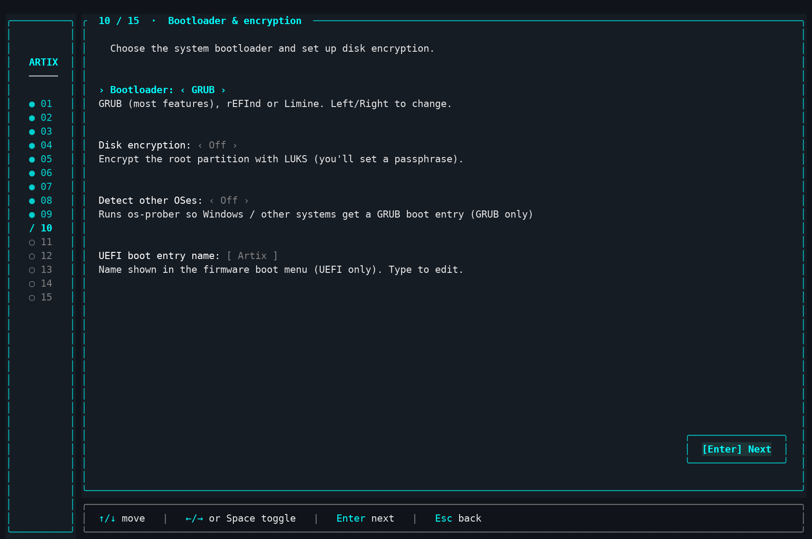

**Paso 11/15 — Discos extra.** Monta otros discos y particiones existentes (p. ej. una de Windows NTFS — manteniendo sus datos).

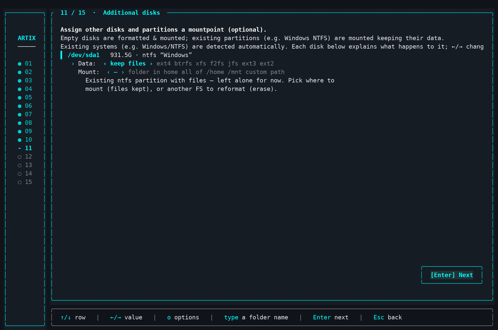

**Paso 12/15 — Cuentas.** Nombre de host, usuario y contraseñas; modo de cuenta.

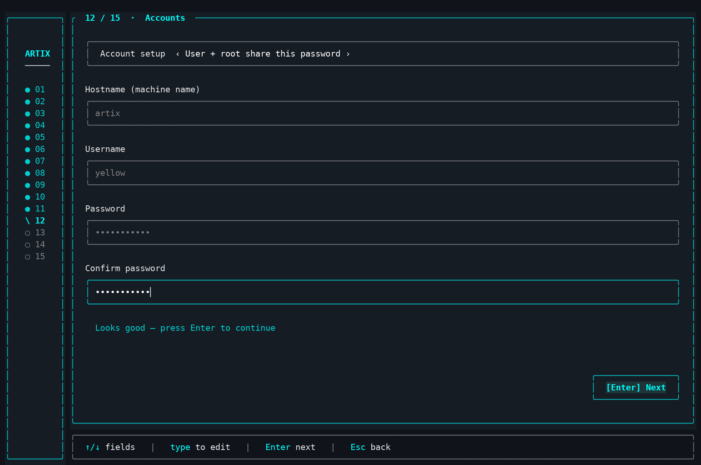 

**Paso 13/15 — Opciones de instalación.** Contraseña sudo, repo Chaotic-AUR, optimización de mirrors.

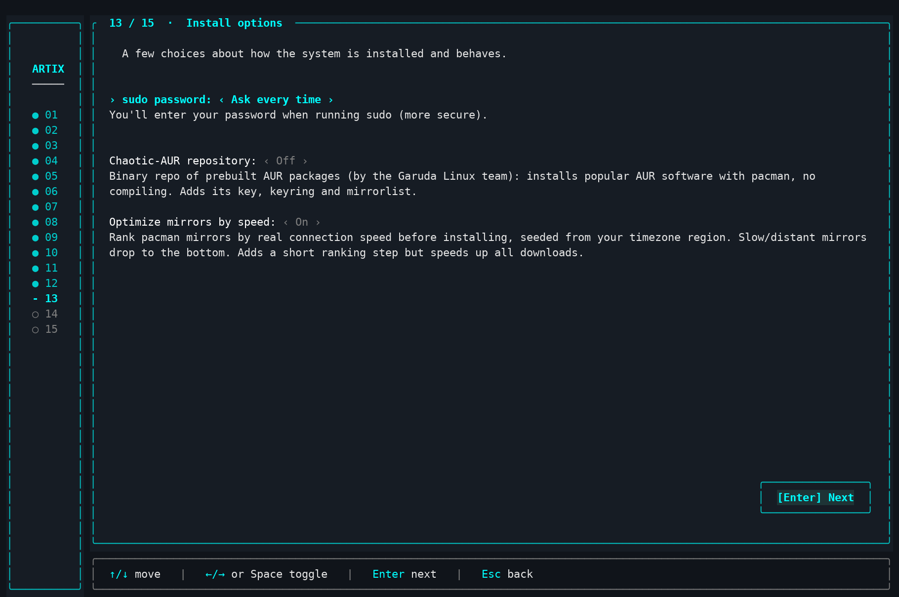

**Paso 14/15 — Revisar e instalar.** Un resumen de cada elección antes de que comience.


**Paso 15/15 — Finalizar.** Un código QR de donación para la defensa de Ucrania, además de una elección: reiniciar, apagar o ingresar al sistema instalado para pasos manuales.

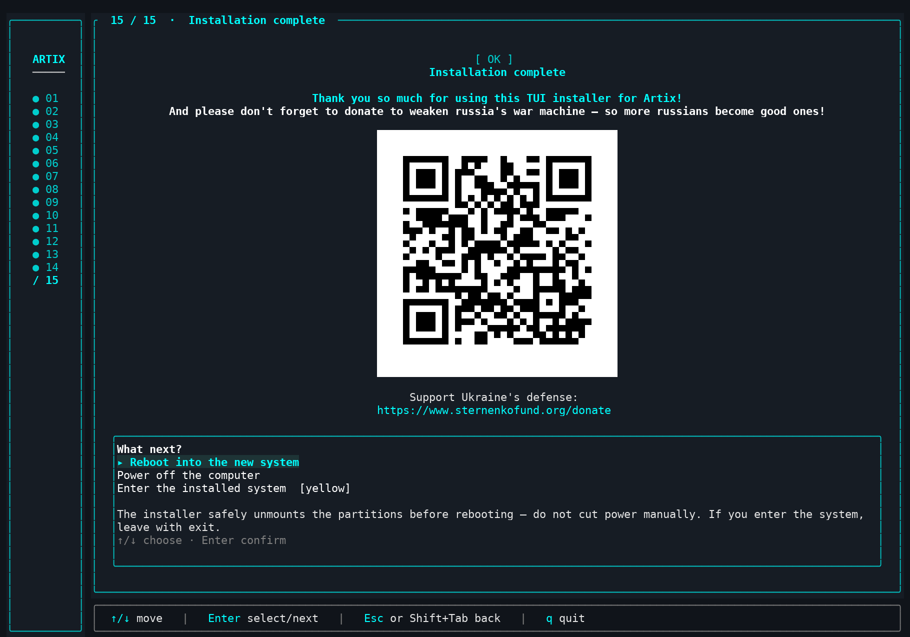

---

## 📄 Licencia

Liberado bajo la licencia **Apache 2.0** — texto completo en [`LICENSE`](LICENSE).
