<div align="center">

# 🐧 Artix TUI Інсталятор

**🇺🇦 Українська** · [🇬🇧 English](README.en.md)

### Двомовний TUI-інсталятор Artix Linux — dinit, LUKS, btrfs-відкат, Wayland. Без systemd.

<a href="https://github.com/YellowHearth1/artix-tui-installer/actions/workflows/ci.yml"></a>


<a href="LICENSE"></a>


<br>

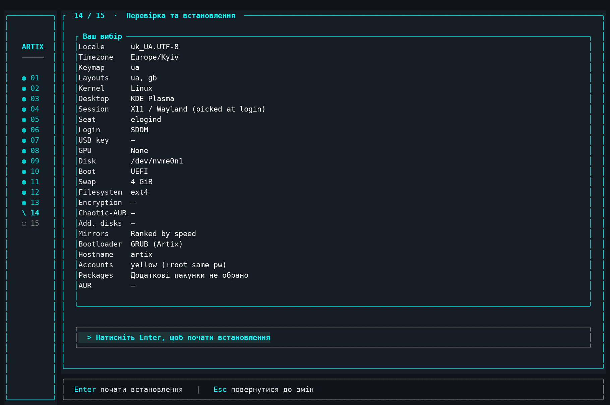

<br>


[](ARCHITECTURE.md)
**[Мапа коду, типові зміни, збірка й тести → ARCHITECTURE.md](ARCHITECTURE.md)**


**Двомовний (українська / англійська) термінальний інсталятор для власної збірки
[Artix Linux](https://artixlinux.org) на системі ініціалізації [dinit](https://davmac.org/projects/dinit/).**

Написаний на Rust із [ratatui](https://ratatui.rs) й оформлений як сучасний
графічний інсталятор: ліва панель кроків, заокруглені панелі, акцент
Artix-блакитного, сегментовані перемикачі та живий прокручуваний журнал
встановлення.

[](https://www.rust-lang.org/)
[](https://ratatui.rs)
[](https://davmac.org/projects/dinit/)

🇬🇧 **[English version → README.en.md](README.en.md)**

</div>

---

> ### 🤖 Авторство коду
>
> **Увесь код цього проєкту написано [Claude](https://claude.ai) — моделлю ШІ
> від [Anthropic](https://www.anthropic.com).** Архітектура, ітеративне
> налагодження та реалізація — повністю згенеровані Claude у діалозі. Дизайн-візія,
> тестування на реальному залізі та віртуальних машинах, а також рішення,
> специфічні для Artix/dinit, належать авторові проєкту.

---

📋 **[Журнал змін](CHANGELOG.md)** — що змінилось у кожній версії.

## ✨ Можливості

- **🌐 Двомовний інтерфейс** — українська та англійська, вибір на першому екрані.
- **⚙️ Рідний dinit** — налаштовує користувацький екземпляр dinit саме під цю
  систему ініціалізації, без жодних припущень про systemd:
  - **turnstile** для `seatd` (власний PAM-модуль, не потребує elogind);
  - **userspawn** для `elogind` (штатний Artix-варіант);
  - менеджер сеансів `seatd`/`elogind` та користувацькі сервіси PipeWire.
- **📦 Інтерактивне встановлення пакунків** — пакунки ставляться через `pacman`
  під псевдотерміналом, тож *ви* обираєте провайдерів (драйвери GPU/Vulkan,
  мультимедіа-бекенди тощо), а не береться мовчки перший. Однойменні пакунки з
  різних репозиторіїв автоматично беруться з Artix; запити `[Y/n]` підтверджуються.
- **🔒 Шифрування диска LUKS** — лише `root`, **повне шифрування із зашифрованим
  `/boot`** на UEFI, або **USB-ключ** (keyfile дозволяє вводити пароль лише раз).
- **🥾 Вибір завантажувача** — GRUB, rEFInd, Limine або **EFISTUB**; для GRUB — `os-prober`
  для виявлення інших ОС. Налаштовується перед розміткою додаткових дисків.
- **📦 EFISTUB (завантаження без завантажувача)** — прошивка UEFI вантажить ядро
  **напряму**, без проміжного завантажувача (ядра Artix уже зібрані як EFI-стаби,
  `CONFIG_EFI_STUB=y`). initramfs і параметри передаються через запис `efibootmgr`.
  **Не потребує додаткових пакунків чи systemd** — на відміну від UKI, якому
  потрібен `systemd-stub`. Лише UEFI; несумісний із зашифрованим `/boot`. **Сумісний
  із відкатом** — ядро, initramfs і параметри лишаються окремими файлами, тож
  інсталятор реєструє додаткові UEFI-записи для відкату та порятунку (вибираються
  з меню завантаження прошивки). Це основа для Secure Boot (нижче).
- **🔐 Підготовка Secure Boot (лише EFISTUB)** — інсталятор **готує**, але свідомо
  **не вмикає** Secure Boot: ставить `sbctl`, генерує ключі підпису й записує
  докладну двомовну інструкцію в `~/SECURE-BOOT.txt`. Фінальні кроки — занесення
  ключів (`sbctl enroll-keys`), підпис ядра й **перехід прошивки в Setup Mode** —
  користувач робить сам на встановленій системі, бо їх не можна безпечно
  автоматизувати. **Увага: потрібні дії в BIOS/UEFI, і на деякому залізі
  неправильне занесення ключів може закирпичити пристрій** — інсталятор показує
  чіткі попередження. `sbctl` має pacman-hook, що переписує підпис ядра при
  кожному оновленні.
- **🗄️ Додаткові диски** — змонтуйте інші диски чи розділи (у домівку, `/mnt` або
  власний шлях), за бажанням відформатуйте чи зашифруйте кожен. Зашифровані
  додаткові диски розблоковуються автоматично під час завантаження (ключ на
  зашифрованому корені, служба dinit), незалежно від способу розблокування кореня.
- **💾 Вибір файлової системи** — ext4, btrfs, xfs, f2fs, jfs, ext3, ext2.
- **🌳 Btrfs зі знімками та відкатом** — підтоми @/@home/@snapshots/@log/@cache, авто-знімки навколо кожної дії pacman (snapper + snap-pac) і відкат artix-rollback на будь-якому завантажувачі (у GRUB/rEFInd/Limine — окремим пунктом графічного меню, у EFISTUB — окремим записом у меню завантаження прошивки).
- **🖥️ Вибір оточення** — KDE Plasma, LXQt, **Pinnacle** (Wayland-композитор у
  стилі AwesomeWM), XFCE, Cinnamon, MATE, LXDE або без оточення.
- **🎮 Драйвери GPU** — NVIDIA (open-dkms), NVIDIA 580xx (застарілі), nouveau,
  AMD, Intel; nouveau автоматично блокується при виборі пропрієтарного драйвера.
- **🛟 Режим відновлення системи** — монтує наявну інсталяцію (з розшифруванням
  LUKS за потреби), визначає завантажувач і відкриває chroot-оболонку для ремонту.
- **🔁 Підтримка AUR** — `paru` збирається з джерел (щоб завжди відповідати
  системній `libalpm`), а потім встановлює обрані вами пакунки.
- **🧩 Автоматичне ввімкнення сервісів dinit** — будь-який встановлений пакунок
  `*-dinit` отримує ввімкнений сервіс автоматично, чи то з репозиторіїв, чи з AUR.
- **📜 Системне логування з коробки** — `syslog-ng` збирає всі логи в `/var/log`,
  а `logrotate` (через `cronie`) тримає їх **тиждень**, видаляє старіше й ротує
  негайно, якщо файл перевищує **5 ГБ**. Користувацькі сервіси логуються в буфер,
  тож `dinitctl catlog` працює для них одразу.
- **🔥 Готовий фаєрвол** — вбудований конфіг nftables відкриває порти для KDE
  Connect, LocalSend, Sunshine, RustDesk, Steam Remote Play, Syncthing та SSH.
- **🎨 Вбудовані конфіги** — kitty (Catppuccin Mocha), запит starship, fastfetch,
  а для Pinnacle ще й waybar та wofi; зовнішні файли не потрібні.
- **🕹️ Готовність до ігор** — піднімає ліміт відкритих файлів (`nofile`) для
  Wine/Proton fsync, а за бажанням автоматично налаштовує `auto-cpufreq`.
- **🧳 Самодостатній** — потрібні host-інструменти (artools, gptfdisk, cryptsetup
  тощо) встановлюються автоматично, тож інсталятор працює навіть із **офіційного
  ISO Artix**, а не лише з власного образу.
- **🏷️ Налаштовувані** імʼя компʼютера та назва запису UEFI.
- **🚦 Обережний старт** — розмітка диска починається лише після явного
  підтвердження на екрані «Перевірка та встановлення», а потрібні host-інструменти
  (git, gptfdisk, dosfstools, parted тощо) довантажуються у фоні одразу після
  зʼєднання з мережею.
- **⚠️ Застереження перед розміткою** — на екрані вибору диска інсталятор
  ненав'язливо попереджає (не блокуючи вибір), якщо: обраний диск є
  **завантажувальним носієм**, з якого запущено сам інсталятор (виявляється за
  файловою системою iso9660 live-образу); диск **менший за 20 ГіБ** (базова
  система вміститься, але для повного оточення може забракнути місця); або обраний
  **режим UEFI/BIOS не збігається** з тим, у якому реально завантажено комп'ютер
  (що дало б систему, яка не вантажиться). Кожне застереження — це повне,
  зрозуміле речення в окремому вікні з прокруткою (клавіша `w` на списку дисків);
  ви завжди можете продовжити, якщо свідомо цього хочете.
- **🧨 Підтвердження стирання диска** — останній крок перед форматуванням: окреме
  вікно прямо показує, який диск (шлях, модель, обсяг) і які **наявні розділи**
  буде безповоротно знищено, і вимагає явного Enter. Форматування ніколи не
  починається без цього другого підтвердження — випадково стерти не той диск важче.
- **🪞 Швидкі та стійкі дзеркала** — 5 найближчих країн (за вашим часовим
  поясом) ранжуються за **реальною швидкістю** й ставляться зверху; **усі інші
  дзеркала світу лишаються активними** нижче, від ближчих до дальших — жодне не
  закоментоване й не відкинуте. Тож якщо швидке дзеркало «помре» під час
  завантаження, pacman просто переходить до наступного (аж до головного сервера
  Artix), а не перериває встановлення. Російські дзеркала виключаються повністю.
  Плюс опційний Chaotic-AUR із готовими бінарними пакунками AUR.
- **📊 Живий перебіг** — журнал встановлення наживо з прокруткою (PgUp/PgDn,
  Home/End); після помилки — повторний запуск без втрати зробленого вибору.
- **🏁 Три варіанти фіналу** — перезавантажитись, вимкнути компʼютер або одразу
  зайти chroot-ом у нову систему; розділи в усіх випадках відмонтовуються безпечно.
- 📀 Збирається як живий образ ISO через **artools** (`buildiso`).

---

## 👁️ Вигляд

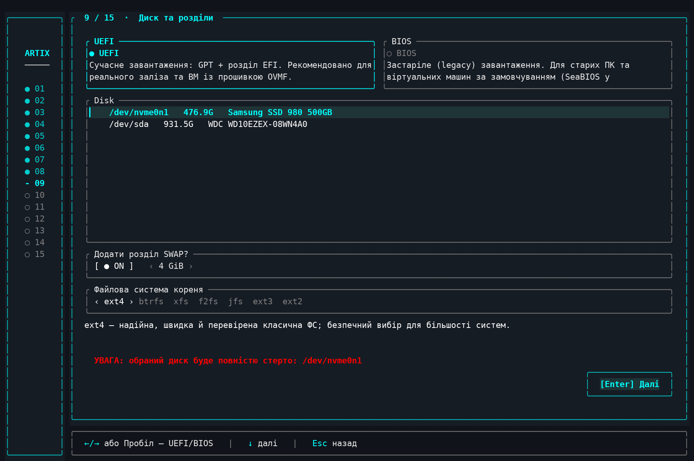

*Знімок — із графічного термінала; у чистому TTY кольори простіші (див. примітку в розділі «Знімки екрана»).*

А схематично кожен екран влаштовано так:

```
┌───────────┬──────────────────────────────────────────────┐
│  ◆  01    │  09 · Диск та розділи                         │
│  ●  02    │  ┌────────────────────────────────────────┐   │
│  ●  …     │  │  Режим      ● UEFI   ○ BIOS             │   │
│  ◆  09    │  │  Диск: /dev/sda  256G                   │   │
│  ○  10    │  │  Додати SWAP?  [так]  [ 4 ГіБ ]         │   │
│  ○  …     │  │  Файлова система  ‹ ext4 ›  btrfs  xfs  │   │
│           │  │              ◂ Назад       Далі ▸       │   │
│           │  └────────────────────────────────────────┘   │
│           ├──────────────────────────────────────────────┤
│           │  ↑/↓ рух · ←/→ зміна · Enter далі             │
└───────────┴──────────────────────────────────────────────┘
```

Ліва панель показує лише номери кроків (на активному крутиться маленький ромб);
повна назва кроку — у заголовку панелі.

---

## ⌨️ Керування

| Клавіші | Дія |
|---|---|
| ↑ / ↓ | рух списками та полями |
| Enter | обрати / далі |
| Esc або Shift+Tab | назад; Esc також закриває модальні вікна |
| ↑ на верхньому пункті | вихід на попередній екран |
| Пробіл | позначити пункт / перемкнути перемикач |
| ← / → | змінити значення: файлова система, розмір SWAP, режим акаунтів, сесія |
| Набір тексту | фільтр списків, пошук пакунків, редагування полів |
| Tab | наступне поле на екрані «Облікові записи» |
| o | опції файлової системи (екран «Диск та розділи») |
| w / s | гортання опису в модальному вікні опцій ФС |
| PgUp / PgDn · Home / End | швидке гортання довгих списків та журналу встановлення |
| q | вихід з інсталятора (заблоковано під час встановлення) |
| Ctrl+C | аварійний вихід |

Контекстні підказки для активного екрана завжди показані в нижньому рядку інтерфейсу.

---

## 🔨 Збірка

```sh
cd installer
cargo build --release
# → target/release/artix-installer
```

Кроки лише для читання (часовий пояс, клавіатура, Wi-Fi, пошук пакунків, перелік
дисків) коректно деградують, коли їхні інструменти недоступні поза цільовою
системою. Саме встановлення (розмітка, basestrap, chroot) потребує root і
справжньої цілі, тож **тестуйте у віртуальній машині**.

---

## 🚀 Запуск на офіційному Artix

Інсталятор не обовʼязково запускати з власного образу — його можна запустити
просто з будь-якого **офіційного Artix**: і з консольного «base» образу, і з
образу спільноти, де є робочий стіл та графічний інсталятор (Calamares) — там
достатньо відкрити термінал і запустити цей TUI замість Calamares. Усі
host-інструменти, яких він потребує (artools, gptfdisk, cryptsetup тощо), він
доставляє сам під час роботи.

### Готовий ISO-образ (найпростіше)

Live-образ Artix зі вшитим інсталятором — записати на флешку й завантажитись:

```sh
curl -LO https://github.com/YellowHearth1/artix-tui-installer/releases/latest/download/artix-tui-dinit-x86_64.iso
```

### Готовий бінарник

Якщо система вже завантажена (напр. з офіційного Artix-ISO) — просто запустіть
інсталятор від root:

```sh
curl -LO https://github.com/YellowHearth1/artix-tui-installer/releases/latest/download/artix-installer
chmod +x artix-installer
sudo ./artix-installer
```

Обидва посилання завжди ведуть на **найсвіжішу збірку** — `latest` GitHub
розвʼязує сам. Усі збірки — на [сторінці релізів](https://github.com/YellowHearth1/artix-tui-installer/releases).

### Збірка з джерел

`base-devel` дає компілятор і компонувальник, потрібні `cargo`:

```sh
sudo pacman -S --needed git rust base-devel
git clone https://github.com/YellowHearth1/artix-tui-installer.git
cd artix-tui-installer/installer
cargo build --release
sudo ./target/release/artix-installer
```

Кілька зауваг:

- Інсталятор **має працювати від root** — він розмічає диски, виконує `basestrap`
  і `chroot`.
- Це повноекранний TUI: запускайте у справжній консолі (`Ctrl`+`Alt`+`F2`) або в
  терміналі живого робочого столу, розміром щонайменше **80×24**.
- На live-образі збірка з джерел іде в оперативну памʼять; якщо її обмаль —
  візьміть готовий бінарник вище або зберіть його на іншій машині з Artix і
  скопіюйте єдиний файл на цільову.
- ⚠️ Інсталятор **форматує диски** — спершу перевіряйте у віртуальній машині.

---

## 🧭 Кроки майстра

Інсталятор починається з вибору режиму: **Встановлення** або **Відновлення
системи**. Встановлення проходить 15 кроків:

1. **Мова** — українська / англійська; задає мову інтерфейсу та локаль системи.
2. **Часовий пояс** — повний список IANA з фільтром-пошуком.
3. **Wi-Fi** — пропустити (дротове), сканувати або підключитися через `nmcli`.
4. **Клавіатура** — консольні розкладки через `localectl`; перша обрана — основна.
5. **Ядро** — linux / lts / zen / hardened.
6. **Оточення** — вибір графічного оточення (або без нього) та менеджера сеансів.
7. **Пакунки** — драйвер GPU + пошук і множинний вибір з репозиторіїв.
8. **AUR** — підібраний рекомендований список та живий пошук AUR.
9. **Диск** — режим завантаження, цільовий диск, SWAP і файлова система кореня.
10. **Завантажувач і шифрування** — вибір завантажувача (GRUB / rEFInd / Limine),
    виявлення інших ОС (`os-prober`, для GRUB), назва запису UEFI та шифрування
    диска: лише `root`, повне (із зашифрованим `/boot`) чи USB-ключ, обсяг і
    пароль-фраза. Робиться **перед** додатковими дисками, щоб ключ на додатковому
    диску мав сенс.
11. **Додаткові диски** — для кожного знайденого диска/розділу: формат (або
    «зберегти дані»), куди монтувати (домівка / `/mnt` / власний шлях із назвою
    теки) та окрема галочка шифрування. Нічого не змінюється, доки ви не оберете.
12. **Користувач** — імʼя компʼютера, режим запису, імʼя користувача та паролі
    (тримаються лише в памʼяті, на диск інсталятором не пишуться).
13. **Параметри** — sudo без пароля, репозиторій Chaotic-AUR та оптимізація
    дзеркал.
14. **Встановлення** — огляд, а потім живий журнал виконує план крок за кроком;
    зупиняється при помилці й дозволяє повернутися **Назад**.
15. **Завершення** — підсумок і перезавантаження.

Навігація всюди однакова: `↑`/`↓` рухає фокус (а стрілка вгору на найвищому
пункті повертає на попередній крок), `←`/`→` змінює значення, `Enter` — далі,
`Esc` — закрити віконце або повернутися назад.

---

## 🧱 Як організовано встановлення

`src/system/install.rs` будує один упорядкований список дій; екран встановлення
виконує кожну, транслюючи вивід наживо. Орієнтовно:

встановлення host-інструментів → розмітка → форматування (за потреби LUKS) →
монтування → **фаза 1** `basestrap` мінімальної завантажуваної бази (ядро,
firmware, dinit + сервіси, звук, логування) → налаштування репозиторіїв + ключів
→ **фаза 2** інтерактивний `pacman` для оточення, драйверів і ваших пакунків →
облікові записи → локаль / часовий пояс / розкладка / hostname + hosts →
налаштування user-dinit (turnstile або userspawn) → initramfs (з хуком `encrypt`
при шифруванні) → завантажувач → вбудований nftables → логротація →
ввімкнення всіх сервісів dinit → **фаза 3** AUR через `paru`.

---

## 🌳 Btrfs: підтоми, авто-знімки й відкат системи

Якщо на кроці «Диск та розділи» обрати **btrfs**, під вибором файлової системи зʼявляються додаткові опції (кожна — з поясненням «виграш/втрата» просто в інтерфейсі):

- **Підтоми** — схема `@` (корінь), `@home`, `@snapshots` → `/.snapshots`, `@log` → `/var/log`, `@cache` → `/var/cache`. Знімки системи не чіпають `/home` і не роздуваються логами та кешем.
- **Авто-знімки (snapper + snap-pac)** — знімок **до та після кожної транзакції pacman/paru**; вмикає підтоми автоматично (потрібен `@snapshots`).
- **Стиснення (zstd)** — прозоре `compress=zstd` при записі.
- **TRIM для SSD** — `discard=async` у фоні.
- Для будь-якої файлової системи окремо є **noatime**.

Корінь завжди монтується з `rootflags=subvol=@` — за іменем, а не через default-підтом.

Що інсталятор налаштовує для знімків:

- **snapper** конфігурується прямим записом `/etc/snapper/configs/root` (бо `create-config` у chroot не працює): `TIMELINE_CREATE=no` — знімки привʼязані до подій pacman, а не до годинника; `NUMBER_LIMIT=10` — тримаються останні ~10.
- **Очищення за розкладом** — `/etc/cron.d/snapper` (щодня о 5:30) через cronie, бо на dinit немає systemd-таймерів.
- **Базовий знімок першого завантаження** — одноразовий фоновий сервіс чекає, поки піднімуться D-Bus і snapper, робить знімок «clean system (post-install baseline)» і прибирає сам себе.

Відкат працює **на будь-якому завантажувачі** (GRUB, rEFInd, Limine):

- **`sudo artix-rollback [N]`** — показує список знімків; обраний стає новим `@`, старий корінь зберігається як `@.rollback-<час>`, default-підтом перенацілюється, а застарілий pacman-лок зі знімка прибирається (snap-pac робить PRE-знімок ще під `db.lck`). Є також ярлик у меню програм.
- **Відкат до старту системи** — параметр ядра `artix.rollback` відкриває вибір знімка прямо з initramfs; хук mkinitcpio виконується **після** `encrypt`, тож працює і з LUKS. На **GRUB** для цього є окремий пункт меню **System Rollback**.
- Класичний `snapper rollback` теж працює.

Відкат **не залежить від живого ядра**: у `/boot` лежить заморожена пара `vmlinuz-artix-rescue` + `initramfs-artix-rescue.img`, яку pacman не чіпає. Саме її вантажать пункти *System Rollback* у GRUB, rEFInd і Limine — тож навіть коли оновлення зламало ядро чи initramfs, добірник знімків однаково запускається (а поруч є звичайний пункт *rescue kernel* — завантажитись на запасному ядрі без жодного відкату). Пара оновлюється лише після вдалого звичайного завантаження: сервіс `artix-rescue-sync` спрацьовує через 30 с аптайму і спершу звіряє, що зараз працює саме живе ядро (побайтове порівняння з `/usr/lib/modules/$(uname -r)/vmlinuz`), тому зламане ядро ніколи не отруїть копію. А одразу після відкату одноразовий `artix-rollback-fixup` сам узгоджує `/boot` із відновленою системою: повертає ядро зі знімкових `/usr/lib/modules`, перезбирає initramfs, оновлює меню GRUB і заморожує свіжу запасну пару.

> **Чому не grub-btrfs:** його підменю вантажить знімки read-only через overlayfs-хук, зламаний на ядрах ≥ 6.8 (Antynea/grub-btrfs #328) — пункти просто не вантажаться. Натомість `artix-rollback` підмінює `@` і вантажить відновлений корінь **read-write**, без overlay, на будь-якому ядрі й завантажувачі.

---

## 📀 Профіль ISO (`iso-profile/`, для artools `buildiso`)

- `Packages-Root` / `Packages-Live` — пакунки для живого образу (лише dinit).
- `profile.conf` — автологін/дисплей-менеджер для живого сеансу.
- `live-overlay/usr/bin/installer-launch` — дає TUI справжній керівний термінал
  на tty1 (`setsid -c`), із запасним шеллом у разі збою.
- `live-overlay/etc/dinit.d/installer.conf` — сервіс автозапуску інсталятора
  замість getty на tty1.
- `grub-overrides/loopback.cfg` — завантажується одразу в інсталятор.

Покладіть скомпільований бінарник у `live-overlay/usr/bin/artix-installer`, тоді
виконайте `sudo buildiso -p <профіль>`.

---

## 🗂️ Структура проєкту

```
installer/        Сирці Rust (TUI на ratatui + логіка встановлення)
  src/app.rs      модель стану + конфіг
  src/event.rs    глобальна обробка клавіш / навігація
  src/main.rs     точка входу + «графічна» оболонка інсталятора
  src/screens/    по модулю на кожен крок майстра
  src/system/     диск, runner (PTY), план встановлення, пакунки, відновлення
  src/assets/     вбудовані конфіги (kitty, fastfetch, waybar, wofi, pinnacle)
  i18n/           рядки інтерфейсу en.toml / uk.toml
iso-profile/      профіль artools buildiso + накладка живого образу
screenshots/      знімки екрана для README (15 кроків майстра)
```

---

## 📸 Знімки екрана

> **Примітка.** Усі знімки зроблено в графічному емуляторі термінала на машині зі встановленим графічним оточенням. У чистому TTY (наприклад, одразу після завантаження базового образа Artix) інтерфейс виглядає значно скромніше: консоль ядра дає лише 16 кольорів і власний шрифт, тож частина ефектів ratatui — плавні відтінки, приглушені тони, заокруглені рамки — там недоступна або спрощена. Функційно все працює однаково.

Повний прохід майстра — усі **15 кроків**. Інтерфейс двомовний (українська / англійська); знімки нижче зроблено українською.

**Крок 1/15 — Мова.** Мова інтерфейсу та майбутньої системи.

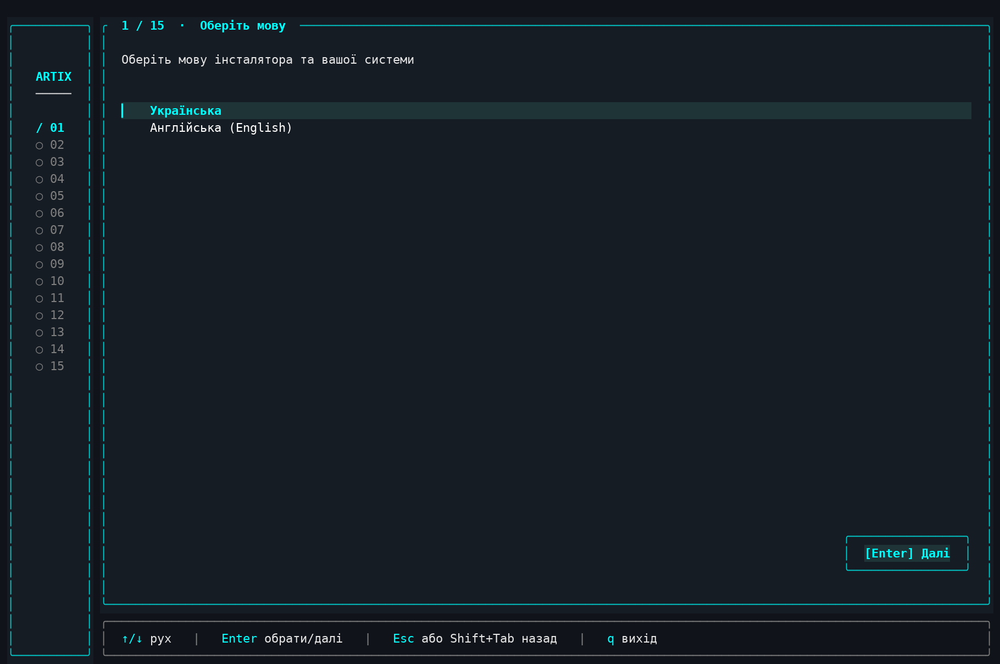

**Крок 2/15 — Часовий пояс.** Пошук і вибір часового поясу.

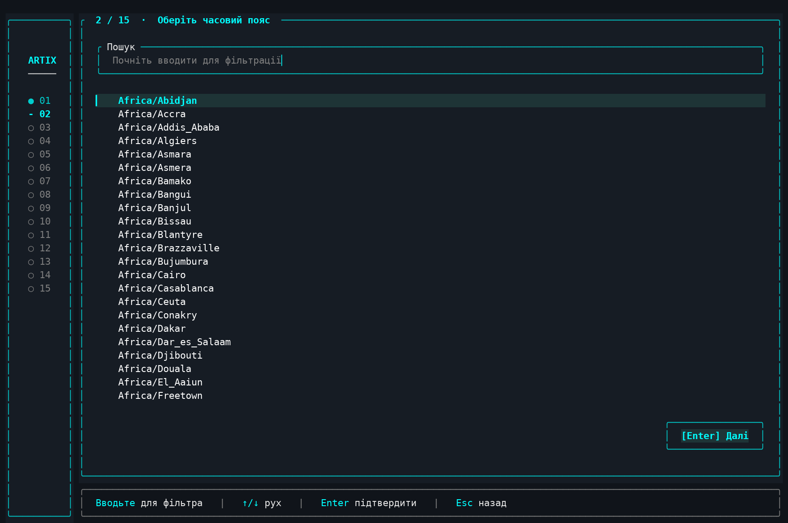

**Крок 3/15 — Мережа.** Пропустити (дротове зʼєднання) або просканувати Wi-Fi: вибір адаптера, мережі та введення паролю.

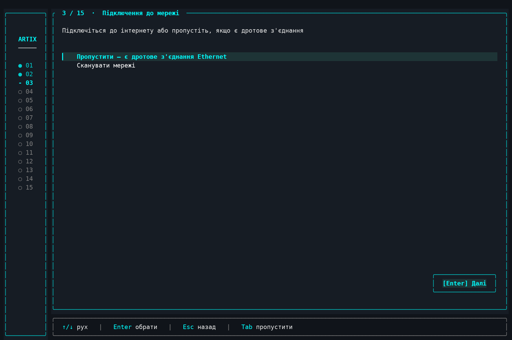

**Крок 4/15 — Розкладка клавіатури.** Мультивибір розкладок із фільтром; перша позначена стає основною.

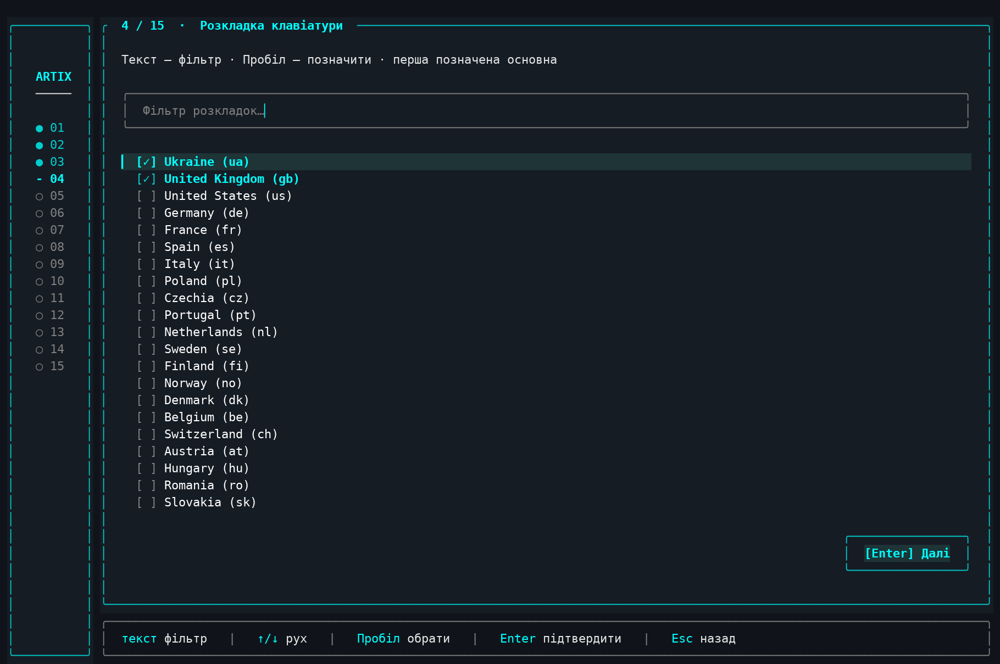

**Крок 5/15 — Ядро.** Linux, Linux Zen, Linux Hardened або Linux LTS.

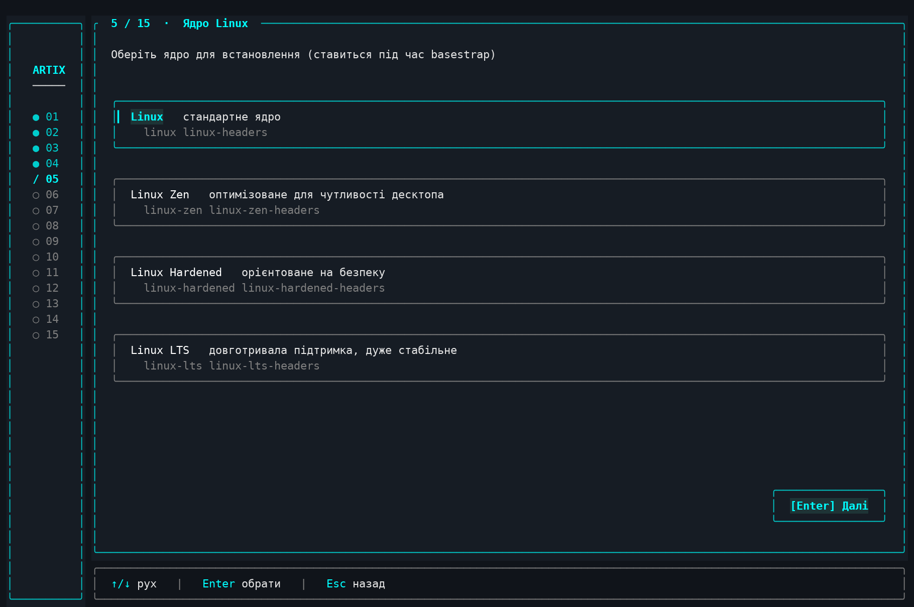

**Крок 6/15 — Графічне оточення.** Мультивибір оточень, перемикання сесії (Wayland/X11) та вибір екрана входу.

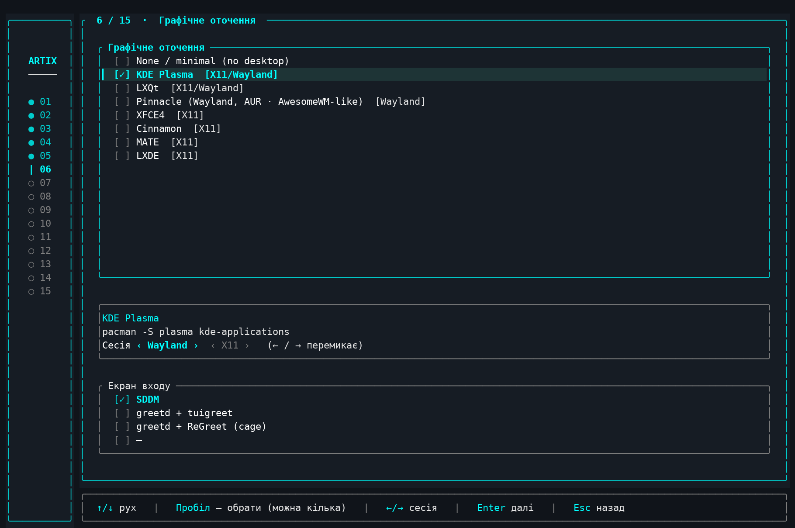

**Крок 7/15 — Додаткові пакунки.** Драйвери відеокарти + пошук і вибір популярних пакунків.

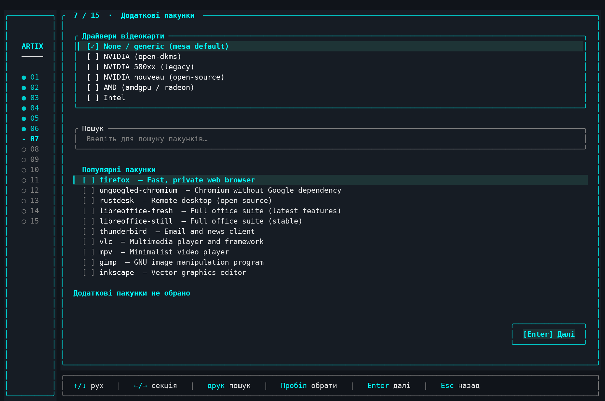

**Крок 8/15 — Пакунки AUR.** Пошук в AUR і рекомендовані пакунки (збірка через paru).

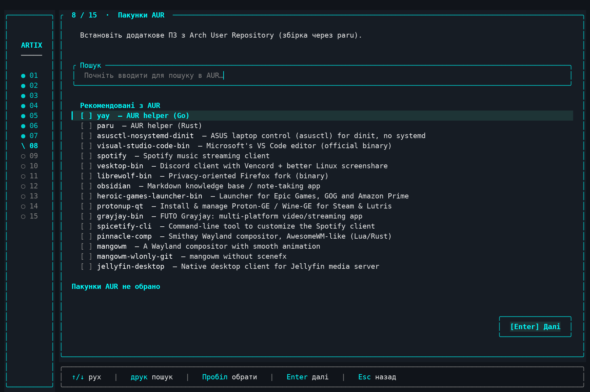

**Крок 9/15 — Диск і розділи.** UEFI/BIOS, вибір диска, розділ SWAP, файлова система кореня.


**Крок 10/15 — Завантажувач і шифрування.** GRUB / rEFInd / Limine / EFISTUB, os-prober, назва UEFI-запису, шифрування LUKS.

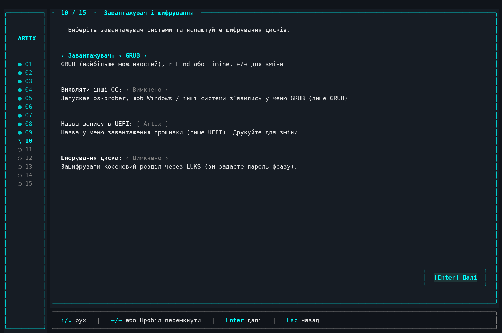

**Крок 11/15 — Додаткові диски.** Монтування інших дисків і наявних розділів (напр. Windows NTFS — зі збереженням даних).

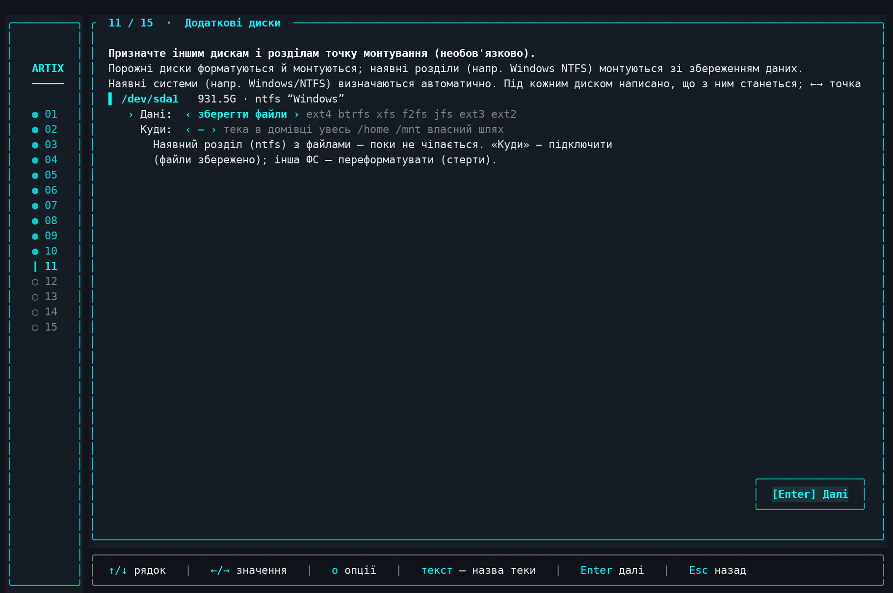

**Крок 12/15 — Облікові записи.** Імʼя компʼютера, користувач і паролі; режим облікових записів.

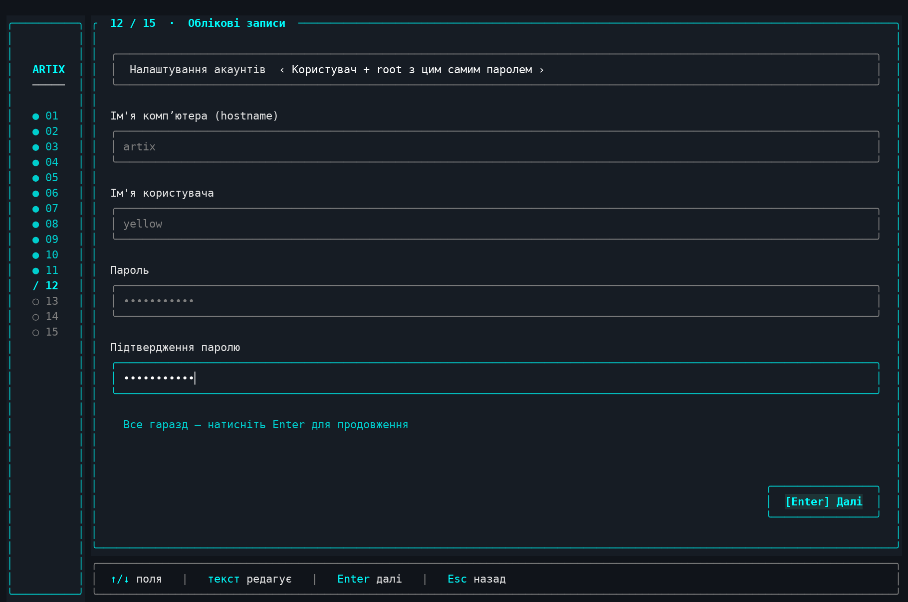

**Крок 13/15 — Параметри встановлення.** Пароль sudo, репозиторій Chaotic-AUR, оптимізація дзеркал.

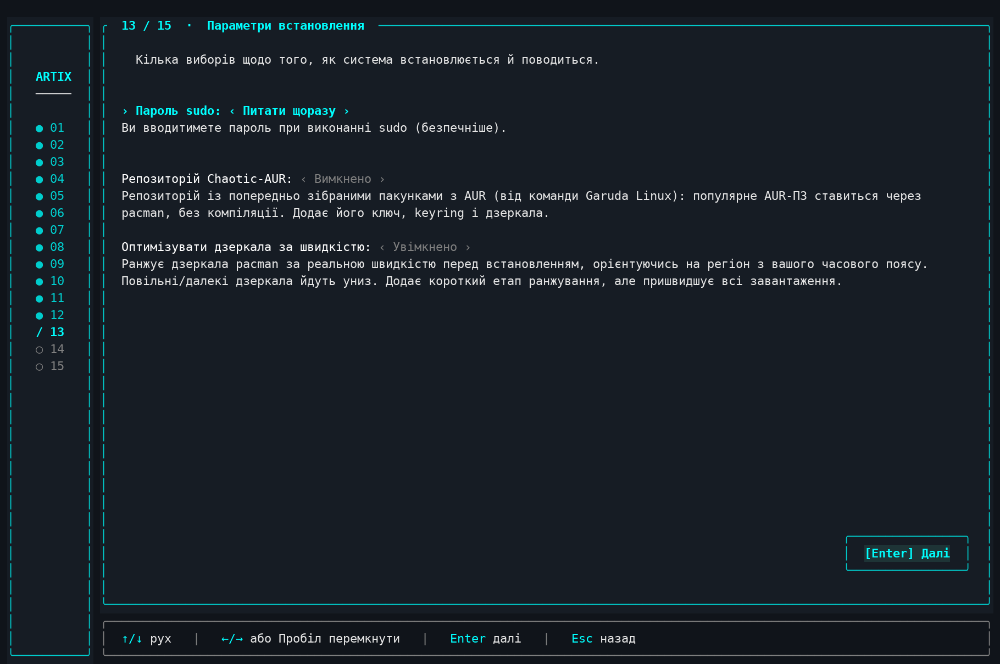

**Крок 14/15 — Перевірка та встановлення.** Підсумок усіх виборів перед стартом.


**Крок 15/15 — Завершення.** QR-код для донату на оборону України та вибір: перезавантажити, вимкнути чи зайти у встановлену систему для ручних кроків.

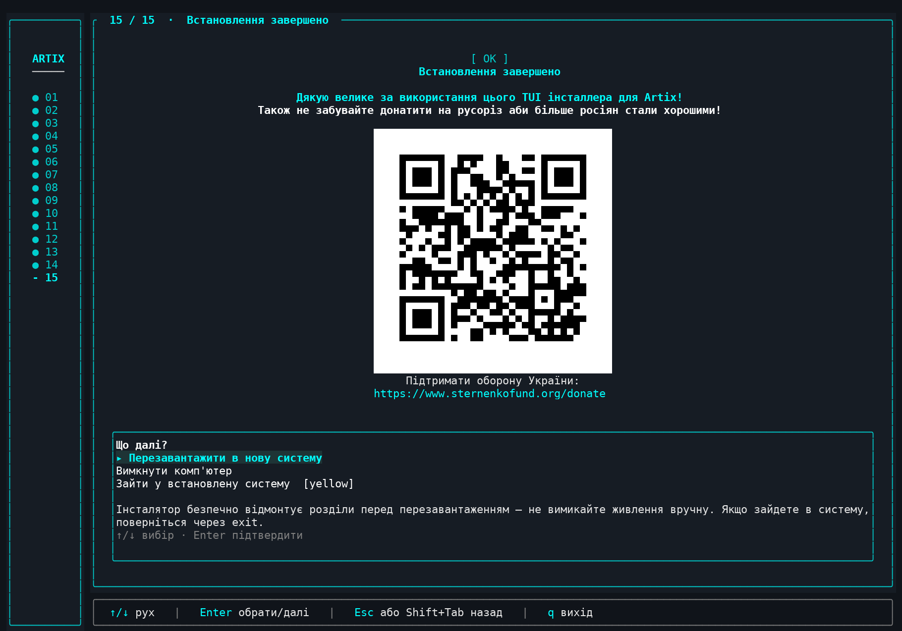

---

## 📄 Ліцензія

Проєкт розповсюджується за ліцензією **Apache 2.0** — повний текст у файлі
[`LICENSE`](LICENSE).
